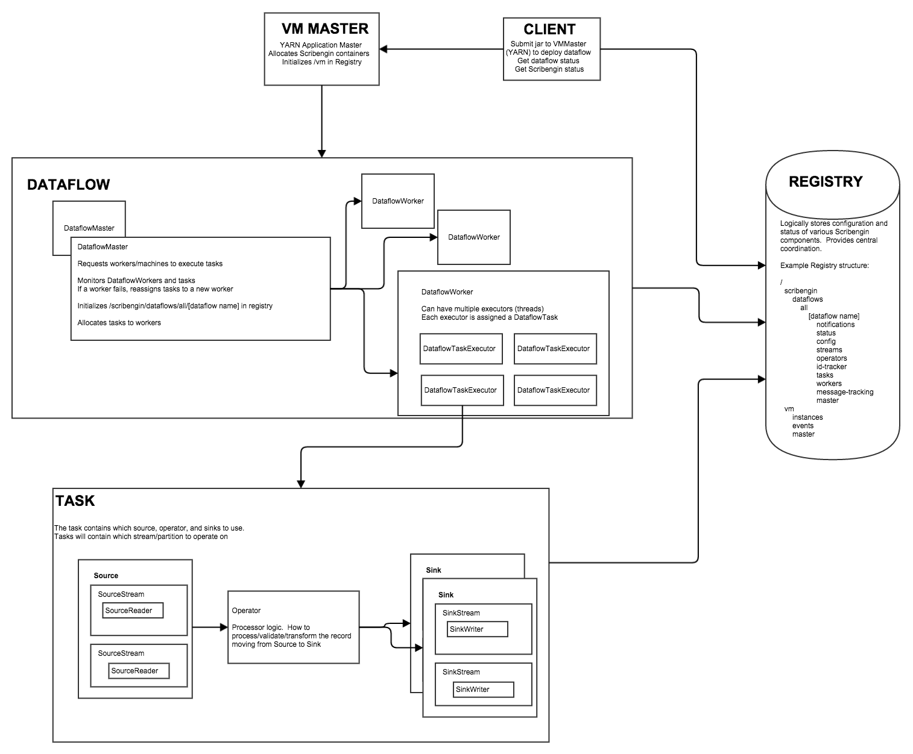

Scribengin
==========

#Contents#
1. [Overview](#overview)
2. [The Problem](#the-problem)
2. [Definitions](#definitions)
3. [Technologies Used](#technologies-used)
4. [Design](#design)
5. [Developer Setup](#developer-setup)
6. [Releasing Code](#release)
7. [Developer Notes on Scribengin modules](#developer-notes-on-scribengin-modules)

####Overview
Pronounced "Scribe Engine" 

Scribengin is a highly reliable (HA) and performant event/logging transport that registers data under defined schemas in a variety of end systems.  Scribengin enables you to have multiple flows of data from a source to a sink. Scribengin will tolerate system failures of individual nodes and will do a complete recovery in the case of complete system failure.

Reads and writes data from sources/sinks:
- Kafka
- HDFS
- S3


####The Problem
The core problem is how to reliably and at scale have a distributed application write data to multiple destination data systems.  This requires the ability to todo data mapping, partitioning with optional filtering to the destination system.

####The Scribengin Solution:
A distributed, highly reliable ETL system that can handle multiple sources and sinks


####Definitions

- A **Dataflow** - is data being moved from a source to a sink(s)
- **Source** - is a system that is being read to get data from (Kafka, Kinesis e.g.)
- **Sink** - is a destination system that is being written to (HDFS, Hbase, Hive e.g.)
- **DataStreamOperator** - is a data processor used to filter, copy, duplicate, transform, etc. any data moving between source and sink


####Technologies Used
- Built in Java
- Gradle
- YARN
- Zookeeper
- Elasticsearch
- Kafka, S3, HDFS - data sources/sinks


####Design


####Quickstart Guide
Get Scribengin launched quickly!  This will walk you how to start a Scribengin instance in YARN.

- [QuickStart Guide](docs/scribengin-cluster-setup-quickstart.md)


####How to launch a cluster in an arbitrary environment (i.e. in-house cluster, AWS, etc)

- [Arbitrary Cluster Guide](docs/arbitrary-cluster-guide.md)


####Developer Info
- [Get your dev environment setup, learn to write a dataflow](docs/dataflowDevelopment/dataflowDevTableOfContents.md)
- [Operator Development Guide](docs/operator-dev-guide.md)

####Release
```
cd NeverwinterDP
../gradlew clean build release -x test

#Code and jars will be released to NeverwinterDP/release/build/release/
```


  