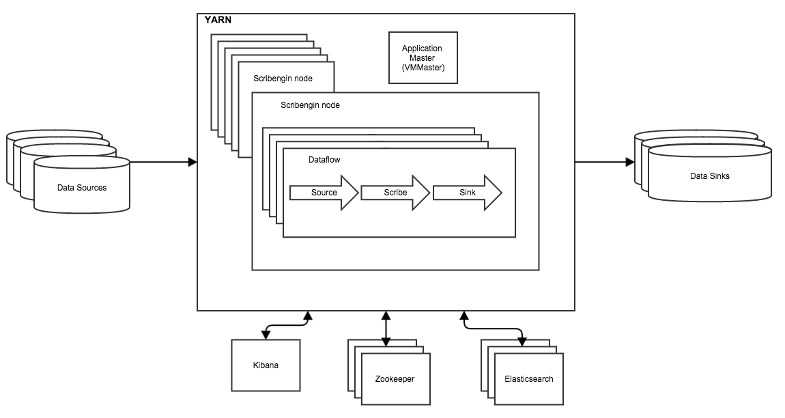

Scribengin
==========

#Contents#
1. [Overview](#overview)
2. [The Problem](#the-problem)
3. [The Scribengin Solution](#the-scribengin-solution)
4. [Read this to get Started](#read-this-to-get-started)
5. [Performance Results](#performance-results)
6. [Quickstart Guides](#quickstart-guides)
5. [Developer Info](#developer-info)
6. [Developer Guidelines](#developer-guidelines)
6. [Releasing Code](#release)

####Overview
Pronounced "Scribe Engine" 

Scribengin is a highly reliable, highly available, and performant event/logging transport that registers data under defined schemas in a variety of end systems.  Scribengin enables users to have multiple flows of data from a data source to a data sink. Scribengin will tolerate system failures of individual nodes and will do a complete recovery in the case of system failure.


####The Problem
The core problem is how to reliably and scalably have a distributed application write data to multiple destination data systems.  This requires the ability to do data mapping, partitioning, data enhancement, data transformation, and optional filtering to the destination system.

####The Scribengin Solution:
A distributed, highly reliable ETL system that can handle multiple sources and sinks



####Read this to get started!

- [High Level Scribengin Features](docs/features.md)
- [Learn the Scribengin terminology, and get acquainted with Scribengin at a high level.](docs/terminology.md)

####Performance results

- [AWS Performance Testing](docs/performanceResults/perfJan2016.md)

####Quickstart Guides
Get Scribengin launched quickly!  This will walk users how to start a Scribengin instance in YARN.

- [QuickStart Guide](docs/development/deployment/scribengin-cluster-setup-quickstart.md)
- [How to launch a cluster in any arbitrary environment i.e. in-house cluster, AWS, etc](docs/development/deployment/arbitrary-cluster-guide.md)


####Developer Info
- [Dev environment setup, learn to write a dataflow](docs/development/dataflow/dataflowDevTableOfContents.md)
- [Operator Development Guide](docs/development/dataflow/operator-dev-guide.md)

####Developer Guidelines
- [Code Conventions](docs/development/code-convention-howto.md)
- [Code Organization](docs/development/code-organization-howto.md)
- [Dataflow Performance and Validation](docs/development/dataflow-performance-and-validation-howto.md)
- [Run Test](docs/development/run-test-howto.md)

####Release
```
cd NeverwinterDP
./gradlew clean build release -x test

#Code and jars will be released to NeverwinterDP/release/build/release/
```


  
