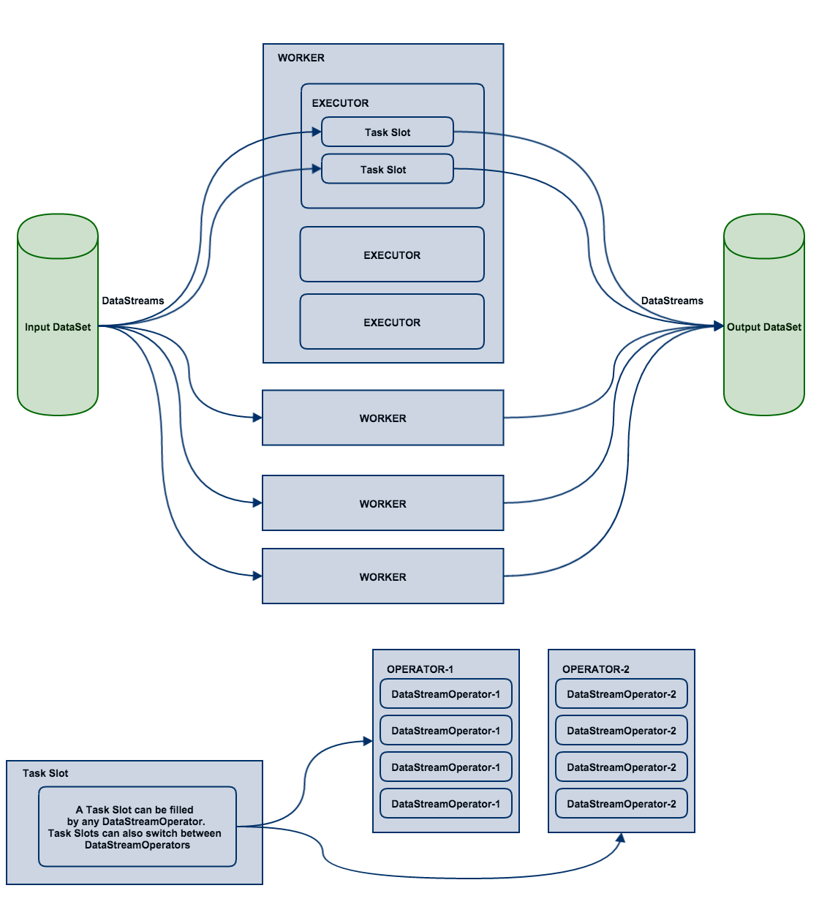

Configuring Dataflows
=====================

- [Introduction](#introduction)
- [Definitions](#definitions)
- [Worker Breakdown](#worker-breakdown)
- [Dataflow Configuration](#dataflow-configuration)
  - [Workers](#workers)
  - [Executors](#executors)
  - [Default Parallelism](#default-parallelism)
  - [Default Replication](#default-replication)
- [Configuring Correctly](#configuring-correctly)
- [Examples](#examples)
  - [The Code](#the-code)  
  - [Figuring Out The Configuration](#figuring-out-the-configuration)
  - [Kafka Complications](#kafka-complications)

#Introduction

Scribengin works by splitting data up into concurrent streams and dividing the work up between workers and executors.

[Refer to terminology for help on understanding terminology](../terminology.md)

#Worker Breakdown




#Dataflow Configuration

We'll declare our dataflow like so, and then show how to configure it

```java
Dataflow<Message, Message> dfl = new Dataflow<>(dataflowId);
```

##Workers

The number of workers will be the number of containers we request from the VM Master

```java
dfl.getWorkerDescriptor().setNumOfInstances(numOfWorker);
```

##Executors

The number of "threads" per worker

```java
dfl.getWorkerDescriptor().setNumOfExecutor(numOfExecutorPerWorker);
```

##Default Parallelism

The default number of data streams to deploy per operator.

```java
dfl.setDefaultParallelism(defaultParallelism);
```

##Default Replication

The default replication to use for Kafka, HDFS, or any other dataStore that supports replication.  Has no impact on dataSources that do not support configurable replication.

```java
dfl.setDefaultReplication(defaultReplication).
```

#Configuring Correctly

When configuring your dataflow, you must have some prior knowledge about what you're setting up.  You'll need to know the number of streams you'll be expecting, and then set up the number of workers and executors to reflect that.

The following calculation is a good starting point:

```
(number of task slots) = 2

(number of workers) * (number of executors) * (number of task slots) >= (num of streams)

(num of streams)  = (parallelism) * (number of operators)
```

#Examples

##The Code

Let's consider the following code:

```java
Dataflow<Message,Message> dfl = new Dataflow<Message,Message>(dataflowID);
    
    //Example of how to set the KafkaWireDataSetFactory
    dfl.
      setDefaultParallelism(2).
      setDefaultReplication(1);
    
    dfl.getWorkerDescriptor().setNumOfInstances(2));
    dfl.getWorkerDescriptor().setNumOfExecutor(3);

    //Define our input source - set name, ZK host:port, and input topic name
    KafkaDataSet<Message> inputDs = 
        dfl.createInput(new KafkaStorageConfig("input", kafkaZkConnect, inputTopic));
    
    //Define our output sink - set name, ZK host:port, and output topic name
    DataSet<Message> outputDs = 
        dfl.createOutput(new KafkaStorageConfig("output", kafkaZkConnect, outputTopic));
    
    //Define which operators to use.  
    //This will be the logic that ties the datasets and operators together
    Operator<Message, Message> splitter = dfl.createOperator("splitteroperator", SplitterDataStreamOperator.class);
    Operator<Message, Message> odd      = dfl.createOperator("oddoperator", PersisterDataStreamOperator.class);
    Operator<Message, Message> even     = dfl.createOperator("evenoperator", PersisterDataStreamOperator.class);

    //Send all input to the splitter operator
    inputDs.useRawReader().connect(splitter);
    
    //The splitter operator then connects to the odd and even operators
    splitter.connect(odd)
            .connect(even);
    
    //Both the odd and even operator connect to the output dataset
    // This is arbitrary, we could connect them to any dataset or operator we wanted
    odd.connect(outputDs);
    even.connect(outputDs);
```


##Figuring Out The Configuration

Let's assume Kafka's default number of partition (num.partitions) is set to the default, 1.  The input topic is written to with this default number of partitions.

Since we're setting defaultParallelism to "2", we know we'll have two partitions by default for every operator we control.

The number of streams will be:
```
1 (partition) x 1 (input operator) + 
2 (partition) x 1 (output operator) + 
2 (partition) x 3 (splitter, odd, and even operator) = 8 streams
```

The number of available operator slots will be:
```
2 (workers) x 3 (executors per worker) x 2 (number of task slots) = 12 
```

Therefore, this will be a good configuration with room to spare
```
12 (number of task slots) >= 8 (streams)
```


##Kafka Complications

What happens if Kafka's default number of partitions is set to something other than 1?  Let's assume for this example that the number of default partitions is set to 5, and that data written into Kafka was written with this default.  

In this case, the number of task slots will be off!

The number of streams will be:
```
5 (partition) x 1 (input operator) + 
2 (partition) x 1 (output operator) + 
2 (partition) x 3 (splitter, odd, and even operator) = 13 streams
```

The number of available operator slots will be insufficient! :
```
2 (workers) x 3 (executors per worker) x 2 (number of task slots) = 12 
```

Therefore, this will be a bad configuration.
```
12 (number of task slots) < 13 (streams)
```

We would fix this by either increasing the number of Workers or the number of Executors.


