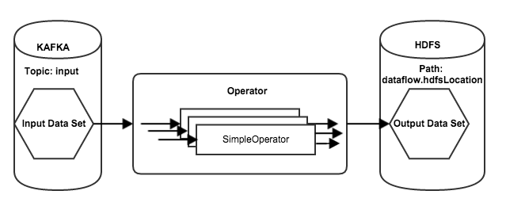

HDFS Dataflow Development
=========================


- [Introduction](#introduction)
- [Sample Code](#sample-code)
- [A Kafka to HDFS Dataflow](#a-kafka-to-hdfs-dataflow)
  - [Overview](#overview)  
  - [Partitioning](#partitioning)
  - [Important Code Differences](#important-code-differences)
- [The Dataflow Submitter](#the-dataflow-submitter)
- [Writing a Unit Test](#writing-a-unit-test)
- [Launching in a real Scribengin Cluster](#launching-in-a-real-scribengin-cluster)

#Introduction#

This howto will show you how to develop your own dataflow and to push data from Kafka to HDFS.  

#Sample code#
You can find sample code in the Scribengin package com.neverwinterdp.scribengin.example.*. The code comes complete with unit tests and full comments.

#A Kafka to HDFS Dataflow

##Overview

This example is almost idential to creating a dataflow that pushes data from Kafka to Kafka.  We'll even be using the same DataStreamOperator!

The diagram below shows how this dataflow will string together.

- The input is a Kafka topic called "input.topic"
- An operator reads this topic and pushes the data into the configured output data set
- The output will be HDFS



##Partitioning

We'll be setting our default parallelism to 8, so our operator will create 8 partitions in HDFS.  Our default location for writing data is set to ```build/working/storage/hdfs/output```, so our final output will have a file structure similar to this in HDFS

```
hdfs://{homedir}/build/working/storage/hdfs/output
├── partition-0
│   └── segment-000001.dat
├── partition-1
│   └── segment-000001.dat
├── partition-2
│   └── segment-000001.dat
├── partition-3
│   └── segment-000001.dat
├── partition-4
│   └── segment-000001.dat
├── partition-5
│   └── segment-000001.dat
├── partition-6
│   └── segment-000001.dat
└── partition-7
│   └── segment-000001.dat
│   └── segment-000002.dat
```

##Important Code Differences 

The main changes we'll have to implement are setting two new properties:
```java
    //Where in the registry to store HDFS info (Not suggested to change this)
    HDFSRegistryPath = props.getProperty("dataflow.hdfsRegistryPath", "/storage/hdfs/output");
    
    //Where in HDFS to store our data
    HDFSLocation = props.getProperty("dataflow.hdfsLocation", "build/working/storage/hdfs/output");
```

We'll use these properties to define our HDFS output DataSet.
```java
    //Our output sink will be HDFS
    //"output" - the dataset's name
    //HDFSRegistryPath - where in the registry to HDFS config
    //HDFSLocation - the path in HDFS to put our data
    DataSet<Message> outputDs = dfl.createOutput(new HDFSStorageConfig("output", HDFSRegistryPath, HDFSLocation));

```


#The Dataflow Submitter
```java
import java.util.Properties;

import com.neverwinterdp.message.Message;
import com.neverwinterdp.scribengin.dataflow.DataSet;
import com.neverwinterdp.scribengin.dataflow.Dataflow;
import com.neverwinterdp.scribengin.dataflow.DataflowDescriptor;
import com.neverwinterdp.scribengin.dataflow.DataflowSubmitter;
import com.neverwinterdp.scribengin.dataflow.KafkaDataSet;
import com.neverwinterdp.scribengin.dataflow.Operator;
import com.neverwinterdp.scribengin.dataflow.example.simple.SimpleDataStreamOperator;
import com.neverwinterdp.scribengin.shell.ScribenginShell;
import com.neverwinterdp.storage.hdfs.HDFSStorageConfig;
import com.neverwinterdp.storage.kafka.KafkaStorageConfig;
import com.neverwinterdp.util.JSONSerializer;

public class ExampleHdfsDataflowSubmitter {
  private String dataflowID;
  private int defaultReplication;
  private int defaultParallelism;
  
  private int numOfWorker;
  private int numOfExecutorPerWorker;
  
  private String inputTopic;
  
  private String HDFSRegistryPath;
  private String HDFSLocation;
  
  private ScribenginShell shell;
  private DataflowSubmitter submitter;
  
  public ExampleHdfsDataflowSubmitter(ScribenginShell shell){
    this(shell, new Properties());
  }
  
  /**
   * Constructor - sets shell to access Scribengin and configuration properties 
   * @param shell ScribenginShell to connect to Scribengin with
   * @param props Properties to configure the dataflow
   */
  public ExampleHdfsDataflowSubmitter(ScribenginShell shell, Properties props){
    //This it the shell to communicate with Scribengin with
    this.shell = shell;
    
    //The dataflow's ID.  All dataflows require a unique ID when running
    dataflowID = props.getProperty("dataflow.id", "ExampleDataflow");
    
    //The default replication factor for Kafka
    defaultReplication = Integer.parseInt(props.getProperty("dataflow.replication", "1"));
    //The number of DataStreams to deploy 
    defaultParallelism = Integer.parseInt(props.getProperty("dataflow.parallelism", "8"));
    
    //The number of workers to deploy (i.e. YARN containers)
    numOfWorker                = Integer.parseInt(props.getProperty("dataflow.numWorker", "2"));
    //The number of executors per worker (i.e. threads per YARN container)
    numOfExecutorPerWorker     = Integer.parseInt(props.getProperty("dataflow.numExecutorPerWorker", "2"));
    
    //The kafka input topic
    inputTopic = props.getProperty("dataflow.inputTopic", "input.topic");
    
    //Where in the registry to store HDFS info (Not suggested to change this)
    HDFSRegistryPath = props.getProperty("dataflow.hdfsRegistryPath", "/storage/hdfs/output");
    
    //Where in HDFS to store our data
    HDFSLocation = props.getProperty("dataflow.hdfsLocation", "build/working/storage/hdfs/output");
    
  }
  
  /**
   * The logic to submit the dataflow
   * @param kafkaZkConnect [host]:[port] of Kafka's Zookeeper conenction 
   * @throws Exception
   */
  public void submitDataflow(String kafkaZkConnect) throws Exception{
    Dataflow<Message, Message> dfl = buildDataflow(kafkaZkConnect);
    //Get the dataflow's descriptor
    DataflowDescriptor dflDescriptor = dfl.buildDataflowDescriptor();
    //Output the descriptor in human-readable JSON
    System.out.println(JSONSerializer.INSTANCE.toString(dflDescriptor));

    //Ensure all your sources and sinks are up and running first, then...

    //Submit the dataflow and wait until it starts running
    submitter = new DataflowSubmitter(shell.getScribenginClient(), dfl).submit().waitForRunning(60000);
    
  }
  
  /**
   * Wait for the dataflow to complete within the given timeout
   * @param timeout Timeout in ms
   * @throws Exception
   */
  public void waitForDataflowCompletion(int timeout) throws Exception{
    this.submitter.waitForFinish(timeout);
  }
  
  /**
   * The logic to build the dataflow configuration
   * @param kafkaZkConnect [host]:[port] of Kafka's Zookeeper conenction 
   * @return
   */
  public Dataflow<Message,Message> buildDataflow(String kafkaZkConnect){
    //Create the new Dataflow object
    // <Message,Message> pertains to the <input,output> object for the data
    Dataflow<Message,Message> dfl = new Dataflow<Message,Message>(dataflowID);
    dfl.
      setDefaultParallelism(defaultParallelism).
      setDefaultReplication(defaultReplication);
    
    dfl.getWorkerDescriptor().setNumOfInstances(numOfWorker);
    dfl.getWorkerDescriptor().setNumOfExecutor(numOfExecutorPerWorker);
    
    
    //Define our input source - set name, ZK host:port, and input topic name
    KafkaDataSet<Message> inputDs = 
        dfl.createInput(new KafkaStorageConfig("input", kafkaZkConnect, inputTopic));
    
    //Our output sink will be HDFS
    //"output" - the dataset's name
    //HDFSRegistryPath - where in the registry to HDFS config
    //HDFSLocation - the path in HDFS to put our data
    DataSet<Message> outputDs = dfl.createOutput(new HDFSStorageConfig("output", HDFSRegistryPath, HDFSLocation));
    
    //Define which operator to use.  
    //This will be the logic that ties the input to the output
    Operator<Message, Message> operator     = dfl.createOperator("simpleOperator", SimpleDataStreamOperator.class);
    
    //Connect your input to the operator
    inputDs.useRawReader().connect(operator);
    //Connect your operator to the output
    operator.connect(outputDs);

    return dfl;
  }
}
```


#Writing a Unit Test

The main difference to note in this unit test is how we do the verification of our data stored in HDFS.  We use an internal Scribengin class to be able to read our partitioned data easily.  Study the function ```readDirsRecursive()``` for how it works.


```java
import static org.junit.Assert.assertEquals;

import java.util.Properties;

import kafka.javaapi.producer.Producer;
import kafka.producer.KeyedMessage;
import kafka.producer.ProducerConfig;

import org.apache.hadoop.conf.Configuration;
import org.apache.hadoop.fs.FileSystem;
import org.apache.hadoop.fs.Path;
import org.junit.After;
import org.junit.Before;
import org.junit.Test;

import com.neverwinterdp.message.Message;
import com.neverwinterdp.registry.Registry;
import com.neverwinterdp.registry.RegistryConfig;
import com.neverwinterdp.scribengin.LocalScribenginCluster;
import com.neverwinterdp.scribengin.shell.ScribenginShell;
import com.neverwinterdp.storage.hdfs.HDFSStorage;
import com.neverwinterdp.storage.hdfs.HDFSStorageConfig;
import com.neverwinterdp.storage.hdfs.source.HDFSSource;
import com.neverwinterdp.storage.source.SourcePartitionStream;
import com.neverwinterdp.storage.source.SourcePartitionStreamReader;

public class ExampleHdfsDataflowSubmitterTest {
  LocalScribenginCluster localScribenginCluster ;
  ScribenginShell shell;
  int numMessages = 10000;
  String BASE_DIR = "build/working";
  Registry registry;
  
  /**
   * Setup a local Scribengin cluster
   * This sets up kafka, zk, and vm-master
   * @throws Exception
   */
  @Before
  public void setup() throws Exception{
    
    System.setProperty("app.home", BASE_DIR + "/scribengin");
    System.setProperty("vm.app.dir", BASE_DIR + "/scribengin");
    
    localScribenginCluster = new LocalScribenginCluster(BASE_DIR) ;
    localScribenginCluster.clean(); 
    localScribenginCluster.useLog4jConfig("classpath:scribengin/log4j/vm-log4j.properties");  
    localScribenginCluster.start();
    registry = RegistryConfig.getDefault().newInstance().connect();
    shell = localScribenginCluster.getShell();
    
  }
  
  /**
   * Destroy the local Scribengin cluster and clean up 
   * @throws Exception
   */
  @After
  public void teardown() throws Exception{
    localScribenginCluster.shutdown();
  }
  
  /**
   * Test our HDFS Dataflow Submitter
   * 1. Write data to Kafka into the input topic
   * 2. Run our dataflow
   * 3. Use a HDFS stream reader to read the data in the output HDFS partition and make sure its all present 
   * @throws Exception
   */
  @Test
  public void TestExampleSimpleDataflowSubmitterTest() throws Exception{
    //Create a new DataflowSubmitter with default properties
    ExampleHdfsDataflowSubmitter eds = new ExampleHdfsDataflowSubmitter(shell);
    
    //Populate kafka input topic with data
    sendKafkaData(localScribenginCluster.getKafkaCluster().getKafkaConnect(), eds.getInputTopic());
    
    //Submit the dataflow and wait for it to start running
    eds.submitDataflow(localScribenginCluster.getKafkaCluster().getZKConnect());
    //Output the registry for debugging purposes
    shell.execute("registry dump");
    
    //Get basic info on the dataflow
    shell.execute("dataflow info --dataflow-id "+eds.getDataflowID());
    
    //Give the dataflow a second to get going
    Thread.sleep(1000);
    
    //Do some very simple verification to ensure our data has been moved correctly
    //We'll use some basic HDFS classes to do the reading, so we'll configure our local HDFS FS here
    Path path = new Path(eds.getHDFSLocation());
    FileSystem fs = FileSystem.get(path.toUri(), new Configuration());
    int numEntries = readDirsRecursive(fs, eds.getHDFSRegistryPath(), eds.getHDFSLocation());
    fs.close();
    
    //Make sure all the messages were written
    assertEquals(numEntries, numMessages);
    
    //Get basic info on the dataflow
    shell.execute("dataflow info --dataflow-id "+eds.getDataflowID());
  }
  
  /**
   * Use our HDFSSource to read our data through all partitions
   * @param fs HDFS File system
   * @param registryPath Path to HDFS info in the registry
   * @param hdfsPath Path our data is saved to
   * @return count of records in HDFS
   * @throws Exception
   */
  private int readDirsRecursive(FileSystem fs, String registryPath, String hdfsPath) throws Exception{
    int count = 0;
    
    //Configure our HDFS storage object
    HDFSStorageConfig storageConfig = new HDFSStorageConfig("test", registryPath, hdfsPath);
    HDFSStorage storage = new HDFSStorage(registry, fs, storageConfig);
    
    //Get our source object from the storage object
    HDFSSource source = storage.getSource();
    //Get all source streams
    SourcePartitionStream[] sourceStream = source.getLatestSourcePartition().getPartitionStreams();
    //Read from each individual source stream
    for(int i = 0; i < sourceStream.length; i++) {
      SourcePartitionStreamReader reader = sourceStream[i].getReader("reader-for-stream-" + i);
      Message message = null;
      //Count the number of messages
      while((message = reader.next(3000)) != null) {
        count++;
      }
      reader.close();
    }
    
    return count;
  }
  
  /**
   * Push data to Kafka
   * @param kafkaConnect Kafka's [host]:[port]
   * @param inputTopic Topic to write to
   */
  private void sendKafkaData(String kafkaConnect, String inputTopic){
    Properties props = new Properties();
    props.put("metadata.broker.list", kafkaConnect);
    props.put("serializer.class", "kafka.serializer.StringEncoder");
    props.put("partitioner.class", "kafka.producer.DefaultPartitioner");
    props.put("request.required.acks", "1");
    ProducerConfig config = new ProducerConfig(props);
    
    Producer<String, String> producer = new Producer<String, String>(config);
    for(int i = 0; i < numMessages; i++){
      producer.send(new KeyedMessage<String, String>(inputTopic, "test", Integer.toString(i)));
    }
    producer.close();
  }
  
}
```


##Launching in a real Scribengin Cluster

The process of submitting to a live cluster is the same as in the simple dataflow's example.  Specific parameters may be required, but otherwise the process is the same. 

Please refer to [the simple dataflow development guide](simpleDataflowDev.md#launching-in-a-real-scribengin-cluster)