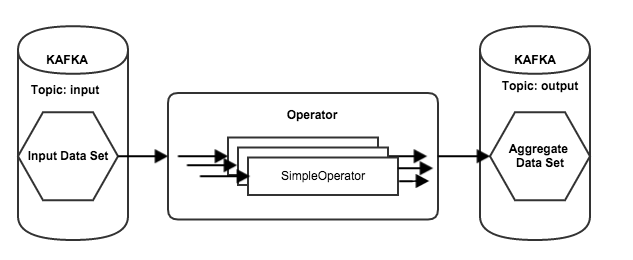

**Table of Contents**  

- [Introduction](#introduction)
- [Sample Code](#sample-code)
- [A Simple Dataflow](#a-simple-dataflow)
  - [Overview](#overview)
  - [Creating a Simple DataStreamOperator](#creating-a-simple-dataStreamOperator)
  - [Create a Simple DataflowSubmitter](#create-a-simple-dataflowSubmitter)
  - [Create a Unit Test](#create-a-unit-test)

#Introduction#

This howto will show you how to develop your own dataflow and operator.  You will then learn how to submit your dataflow to Scribengin to be run.  

##Sample code##
You can find sample code in the Scribengin package com.neverwinterdp.scribengin.example.*. The code comes complete with unit tests and full comments.

#A Simple Dataflow


##Overview##
In order to create a dataflow you need to prepare your sources and sinks, have data in the source, understand your data structure, and decide how to transform the data.



- Create a DataStreamOperator
  - Dataflows split the movement of data into streams for better performance and concurrency
  - An Operator handles moving data from an input to an output
  - An Operator is made up of multiple DataStreamOperators.  Each DataStreamOperator handles a stream of data.
  - A DataStreamOperator can have any arbitrary logic to move, filter, or enhance the data.
- Create a DataflowSubmitter
  -  Once your DataStreamOperator is defined, we'll need to define what our dataflow looks like.
  -  We need to define what the source of data is, which DataStreamOperator to use, and where the data ends up at
- Create a unit test
  - Its much easier to run testing locally before you try deploying to a cluster
- Launch for real!   

##Creating a Simple DataStreamOperator

Our simple DataStreamOperator only takes in the record, and immediately writes it back out to any and all sinks.

```java
package com.neverwinterdp.scribengin.dataflow.example.simple;

import java.util.Set;

import com.neverwinterdp.message.Message;
import com.neverwinterdp.scribengin.dataflow.DataStreamOperator;
import com.neverwinterdp.scribengin.dataflow.DataStreamOperatorContext;

//You must extend DataStreamOperator
public class SimpleDataStreamOperator extends DataStreamOperator{

  //You must override the process() method
  @Override
  public void process(DataStreamOperatorContext ctx, Message record)
      throws Exception {
    
    //Get all sinks
    Set<String> sink = ctx.getAvailableOutputs();
    //For each sink, write the record
    for(String selSink : sink) {
      ctx.write(selSink, record);
    }
  }

}
```

##Create a Simple DataflowSubmitter

Our DataflowSubmitter is where we configure out Dataflow.  We need configure things like how many workers Scribengin will allocate, where our sources and sinks are, and which DataStreamOperator to use.

```java
package com.neverwinterdp.scribengin.dataflow.example.simple;

import java.util.Properties;

import com.neverwinterdp.message.Message;
import com.neverwinterdp.scribengin.dataflow.DataSet;
import com.neverwinterdp.scribengin.dataflow.Dataflow;
import com.neverwinterdp.scribengin.dataflow.DataflowDescriptor;
import com.neverwinterdp.scribengin.dataflow.DataflowSubmitter;
import com.neverwinterdp.scribengin.dataflow.KafkaDataSet;
import com.neverwinterdp.scribengin.dataflow.Operator;
import com.neverwinterdp.scribengin.shell.ScribenginShell;
import com.neverwinterdp.storage.kafka.KafkaStorageConfig;
import com.neverwinterdp.util.JSONSerializer;

public class ExampleSimpleDataflowSubmitter {
  private String dataflowID;
  private int defaultReplication;
  private int defaultParallelism;
  private int maxRunTime;
  
  private int numOfWorker;
  private int numOfExecutorPerWorker;
  
  private String inputTopic;
  private String outputTopic;
  
  private ScribenginShell shell;
  private DataflowSubmitter submitter;
  
  public ExampleSimpleDataflowSubmitter(ScribenginShell shell){
    this(shell, new Properties());
  }
  
  /**
   * Constructor - sets shell to access Scribengin and configuration properties 
   * @param shell ScribenginShell to connect to Scribengin with
   * @param props Properties to configure the dataflow
   */
  public ExampleSimpleDataflowSubmitter(ScribenginShell shell, Properties props){
    //This it the shell to communicate with Scribengin with
    this.shell = shell;
    
    //The dataflow's ID.  All dataflows require a unique ID when running
    dataflowID = props.getProperty("dataflow.id", "ExampleDataflow");
    
    //The default replication factor for Kafka
    defaultReplication = Integer.parseInt(props.getProperty("dataflow.replication", "1"));
    //The number of DataStreams to deploy 
    defaultParallelism = Integer.parseInt(props.getProperty("dataflow.parallelism", "8"));
    //Max amount of time (in ms) to run the dataflow 
    maxRunTime         = Integer.parseInt(props.getProperty("dataflow.maxRunTime", "10000"));
    
    //The number of workers to deploy (i.e. YARN containers)
    numOfWorker                = Integer.parseInt(props.getProperty("dataflow.numWorker", "4"));
    //The number of executors per worker (i.e. threads per YARN container)
    numOfExecutorPerWorker     = Integer.parseInt(props.getProperty("dataflow.numExecutorPerWorker", "2"));
    
    //The kafka input topic
    inputTopic = props.getProperty("dataflow.inputTopic", "input.topic");
    //The kafka output topic
    outputTopic = props.getProperty("dataflow.outputTopic", "output.topic");
    
  }
  
  /**
   * The logic to submit the dataflow
   * @param kafkaZkConnect [host]:[port] of Kafka's Zookeeper conenction 
   * @throws Exception
   */
  public void submitDataflow(String kafkaZkConnect) throws Exception{
    Dataflow<Message, Message> dfl = buildDataflow(kafkaZkConnect);
    //Get the dataflow's descriptor
    DataflowDescriptor dflDescriptor = dfl.buildDataflowDescriptor();
    //Output the descriptor in human-readable JSON
    System.out.println(JSONSerializer.INSTANCE.toString(dflDescriptor));

    //Ensure all your sources and sinks are up and running first, then...

    //Submit the dataflow and wait until it starts running
    submitter = new DataflowSubmitter(shell.getScribenginClient(), dfl).submit().waitForRunning(60000);
    
  }
  
  /**
   * Wait for the dataflow to complete within the given timeout
   * @param timeout Timeout in ms
   * @throws Exception
   */
  public void waitForDataflowCompletion(int timeout) throws Exception{
    this.submitter.waitForFinish(timeout);
  }
  
  /**
   * The logic to build the dataflow configuration
   * @param kafkaZkConnect [host]:[port] of Kafka's Zookeeper conenction 
   * @return
   */
  public Dataflow<Message,Message> buildDataflow(String kafkaZkConnect){
    //Create the new Dataflow object
    // <Message,Message> pertains to the <input,output> object for the data
    Dataflow<Message,Message> dfl = new Dataflow<Message,Message>(dataflowID);
    dfl.
      setDefaultParallelism(defaultParallelism).
      setDefaultReplication(defaultReplication).
      setMaxRuntime(maxRunTime);
    
    dfl.getWorkerDescriptor().setNumOfInstances(numOfWorker);
    dfl.getWorkerDescriptor().setNumOfExecutor(numOfExecutorPerWorker);
    
    
    //Define our input source - set name, ZK host:port, and input topic name
    KafkaDataSet<Message> inputDs = 
        dfl.createInput(new KafkaStorageConfig("input", kafkaZkConnect, inputTopic));
    
    //Define our output sink - set name, ZK host:port, and output topic name
    DataSet<Message> outputDs = 
        dfl.createOutput(new KafkaStorageConfig("output", kafkaZkConnect, outputTopic));
    
    //Define which operator to use.  
    //This will be the logic that ties the input to the output
    Operator<Message, Message> operator     = dfl.createOperator("simpleOperator", SimpleDataStreamOperator.class);
    
    //Connect your input to the operator
    inputDs.useRawReader().connect(operator);
    //Connect your operator to the output
    operator.connect(outputDs);

    return dfl;
  }
  
}

```


##Create a Unit Test 

Before we launch in a real cluster, we want to clear our code of any bugs before we move forward.  Let's go through some of the techniques for writing a unit test.

Our basic methodolgy for testing will be:

1. Setup an in-memory Scribengin cluster
2. Write data to Kafka
3. Launch our dataflow
4. Ensure the data has been moved to our output sink

```java
package com.neverwinterdp.scribengin.dataflow.example.simple;

import static org.junit.Assert.assertEquals;
import static org.junit.Assert.assertTrue;

import java.util.HashMap;
import java.util.List;
import java.util.Map;
import java.util.Properties;

import kafka.consumer.Consumer;
import kafka.consumer.ConsumerConfig;
import kafka.consumer.ConsumerIterator;
import kafka.consumer.KafkaStream;
import kafka.javaapi.consumer.ConsumerConnector;
import kafka.javaapi.producer.Producer;
import kafka.producer.KeyedMessage;
import kafka.producer.ProducerConfig;

import org.junit.After;
import org.junit.Before;
import org.junit.Test;

import com.neverwinterdp.message.Message;
import com.neverwinterdp.scribengin.LocalScribenginCluster;
import com.neverwinterdp.scribengin.dataflow.example.simple.ExampleSimpleDataflowSubmitter;
import com.neverwinterdp.scribengin.shell.ScribenginShell;
import com.neverwinterdp.util.JSONSerializer;

public class ExampleSimpleDataflowSubmitterTest {
  
  LocalScribenginCluster localScribenginCluster ;
  ScribenginShell shell;
  int numMessages = 10000;
  
  /**
   * Setup a local Scribengin cluster
   * This sets up kafka, zk, and vm-master
   * @throws Exception
   */
  @Before
  public void setup() throws Exception{
    String BASE_DIR = "build/working";
    System.setProperty("app.home", BASE_DIR + "/scribengin");
    System.setProperty("vm.app.dir", BASE_DIR + "/scribengin");
    
    localScribenginCluster = new LocalScribenginCluster(BASE_DIR) ;
    localScribenginCluster.clean(); 
    localScribenginCluster.useLog4jConfig("classpath:scribengin/log4j/vm-log4j.properties");  
    localScribenginCluster.start();
    
    shell = localScribenginCluster.getShell();
    
  }
  
  /**
   * Destroy the local Scribengin cluster and clean up 
   * @throws Exception
   */
  @After
  public void teardown() throws Exception{
    localScribenginCluster.shutdown();
  }
  
  /**
   * Test our Simple Dataflow Submitter
   * 1. Write data to Kafka into the input topic
   * 2. Run our dataflow
   * 3. Use a Kafka Consumer to read the data in the output topic and make sure its all present 
   * @throws Exception
   */
  @Test
  public void TestExampleSimpleDataflowSubmitterTest() throws Exception{
    //Create a new DataflowSubmitter with default properties
    ExampleSimpleDataflowSubmitter eds = new ExampleSimpleDataflowSubmitter(shell);
    
    //Populate kafka input topic with data
    sendKafkaData(localScribenginCluster.getKafkaCluster().getKafkaConnect(), eds.getInputTopic());
    
    //Submit the dataflow and wait for it to start running
    eds.submitDataflow(localScribenginCluster.getKafkaCluster().getZKConnect());
    //Output the registry for debugging purposes
    shell.execute("registry dump");
    
    //Get basic info on the dataflow
    shell.execute("dataflow info --dataflow-id ExampleDataflow");
    
    //Get the kafka output topic iterator
    ConsumerIterator<byte[], byte[]> it = 
        getConsumerIterator(localScribenginCluster.getKafkaCluster().getZKConnect(), eds.getOutputTopic());
    
    //Do some very simple verification to ensure our data has been moved correctly
    int numReceived = 0;
    boolean[] assertionArray = new boolean[numMessages];
    
    //while(it.hasNext()){
    for(int i = 0; i < numMessages; i++){
      //This is how we serialize our data back into our Messsage object
      Message message = JSONSerializer.INSTANCE.fromBytes(it.next().message(), Message.class);
      String data = new String(message.getData());
      assertionArray[Integer.parseInt(data)] = true;
      //System.err.println(data);
      numReceived++;
    }
    
    assertEquals(numReceived, numMessages);
    for(boolean b: assertionArray){
      assertTrue(b);
    }
    
  }
  
  
  private void sendKafkaData(String kafkaConnect, String inputTopic){
    Properties props = new Properties();
    props.put("metadata.broker.list", kafkaConnect);
    props.put("serializer.class", "kafka.serializer.StringEncoder");
    props.put("partitioner.class", "kafka.producer.DefaultPartitioner");
    props.put("request.required.acks", "1");
    ProducerConfig config = new ProducerConfig(props);
    
    Producer<String, String> producer = new Producer<String, String>(config);
    for(int i = 0; i < numMessages; i++){
      producer.send(new KeyedMessage<String, String>(inputTopic, "test", Integer.toString(i)));
    }
    producer.close();
  }
  
  private ConsumerIterator<byte[], byte[]> getConsumerIterator(String zkConnect, String outputTopic){
    Properties props = new Properties();
    props.put("zookeeper.connect", zkConnect);
    props.put("group.id", "default");
    
    ConsumerConfig consumerConfig = new ConsumerConfig(props);
    ConsumerConnector consumerConnector = Consumer.createJavaConsumerConnector(consumerConfig);
    Map<String, Integer> topicCountMap = new HashMap<String, Integer>();
    topicCountMap.put(outputTopic, new Integer(1));
    Map<String, List<KafkaStream<byte[], byte[]>>> consumerMap = consumerConnector.createMessageStreams(topicCountMap);
    KafkaStream<byte[], byte[]> stream =  consumerMap.get(outputTopic).get(0);
    return stream.iterator();
  }
  
}

```


