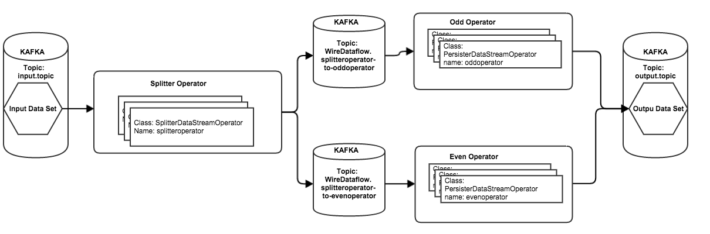

A Wired Dataflow Development
============================


- [Introduction](#introduction)
- [Sample Code](#sample-code)
- [A Wired Dataflow](#a-wired-dataflow)
  - [Overview](#overview)  
  - [Creating a WireDataflowSubmitter](#creating-a-wiredataflowsubmitter)
  - [Creating A SplitterDataStreamOperator](#creating-a-splitterdatastreamoperator)
  - [Creating a PersisterDataStreamOperator](#creating-a persisterdatastreamoperator)
  - [Create a Unit Test](#create-a-unit-test)
  - [Launching in a real Scribengin Cluster](#launching-in-a-real-scribengin-cluster)


#Introduction#

This howto will show you how to develop your own wired dataflow and operators.  A wired dataflow will wire multiple operators together for better reliability and flexability by leveraging Kafka.

#Sample code#
You can find sample code in the Scribengin package com.neverwinterdp.scribengin.dataflow.example.*. The code comes complete with unit tests and full comments.

#A Wired Dataflow

##Overview

Creating a wired datafow is an options for those who wish to wire together different operators.  This guide will show you how to connect operators together with Kafka.

The diagram shows how this dataflow will string together.

- The input is a Kafka topic called "input.topic"
- An operator reads this topic, and determines whether each message should be handed off to the "evenoperator" or "oddoperator".  The data gets pushed into the appropriate intermediary topic.
- The even/odd operators then read in from their appropriate Kafka topics, and in this example both write out to the same Kafka topic, "output.topic"
  - In a real dataflow, we may want these final outputs to be different (i.e. different topics, different sinks like HDFS or S3), but for simplicity we'll keep it like so 




##Creating a WireDataflowSubmitter

The dataflow submitter will be very similar to what we developed in the [simple dataflow development guide](simpleDataflowDev.md).  The main difference to note is we'll be using a WireDataSetFactory.  A WireDataSetFactory is used to "wire" together different operators together by placing a Kafka topic in between for better reliability and buffering.

A small example of how to set it would be:
```java
//Create the new Dataflow object
// <Message,Message> pertains to the <input,output> object for the data
Dataflow<Message,Message> dfl = new Dataflow<Message,Message>(dataflowID);
    
//Example of how to set the KafkaWireDataSetFactory
dfl.setDefaultParallelism(defaultParallelism).
    setDefaultReplication(defaultReplication).
    useWireDataSetFactory(new KafkaWireDataSetFactory(kafkaZkConnect));
```

The full code looks like this:

```java
package com.neverwinterdp.scribengin.dataflow.example.wire;

import java.util.Properties;

import com.neverwinterdp.message.Message;
import com.neverwinterdp.scribengin.dataflow.DataSet;
import com.neverwinterdp.scribengin.dataflow.Dataflow;
import com.neverwinterdp.scribengin.dataflow.DataflowDescriptor;
import com.neverwinterdp.scribengin.dataflow.DataflowSubmitter;
import com.neverwinterdp.scribengin.dataflow.KafkaDataSet;
import com.neverwinterdp.scribengin.dataflow.KafkaWireDataSetFactory;
import com.neverwinterdp.scribengin.dataflow.Operator;
import com.neverwinterdp.scribengin.shell.ScribenginShell;
import com.neverwinterdp.storage.kafka.KafkaStorageConfig;
import com.neverwinterdp.util.JSONSerializer;
import com.neverwinterdp.vm.client.VMClient;

public class ExampleWireDataflowSubmitter {
  private String dataflowID;
  private int defaultReplication;
  private int defaultParallelism;
  
  private int numOfWorker;
  private int numOfExecutorPerWorker;
  
  private String inputTopic;
  private String outputTopic;
  
  private ScribenginShell shell;
  private DataflowSubmitter submitter;
  
  private String localAppHome;
  private String dfsAppHome;
  
  public ExampleWireDataflowSubmitter(ScribenginShell shell){
    this(shell, new Properties());
  }
  
  /**
   * Constructor - sets shell to access Scribengin and configuration properties 
   * @param shell ScribenginShell to connect to Scribengin with
   * @param props Properties to configure the dataflow
   */
  public ExampleWireDataflowSubmitter(ScribenginShell shell, Properties props){
    //This it the shell to communicate with Scribengin with
    this.shell = shell;
    
    //The dataflow's ID.  All dataflows require a unique ID when running
    dataflowID = props.getProperty("dataflow.id", "WireDataflow");
    
    //The default replication factor for Kafka
    defaultReplication = Integer.parseInt(props.getProperty("dataflow.replication", "1"));
    //The number of DataStreams to deploy 
    defaultParallelism = Integer.parseInt(props.getProperty("dataflow.parallelism", "2"));
    
    //The number of workers to deploy (i.e. YARN containers)
    numOfWorker                = Integer.parseInt(props.getProperty("dataflow.numWorker", "5"));
    //The number of executors per worker (i.e. threads per YARN container)
    numOfExecutorPerWorker     = Integer.parseInt(props.getProperty("dataflow.numExecutorPerWorker", "5"));
    
    //The kafka input topic
    inputTopic = props.getProperty("dataflow.inputTopic", "input.topic");
    //The kafka output topic
    outputTopic = props.getProperty("dataflow.outputTopic", "output.topic");
    
    //The example hdfs dataflow local location
    localAppHome = props.getProperty("dataflow.localapphome", "N/A");
    
    //DFS location to upload the example dataflow
    dfsAppHome = props.getProperty("dataflow.dfsAppHome", "/applications/dataflow/splitterexample");
  }
  
  /**
   * The logic to submit the dataflow
   * @param kafkaZkConnect [host]:[port] of Kafka's Zookeeper conenction 
   * @throws Exception
   */
  public void submitDataflow(String kafkaZkConnect) throws Exception{
    //Upload the dataflow to HDFS
    VMClient vmClient = shell.getScribenginClient().getVMClient();
    vmClient.uploadApp(localAppHome, dfsAppHome);
    
    Dataflow<Message, Message> dfl = buildDataflow(kafkaZkConnect);
    //Get the dataflow's descriptor
    DataflowDescriptor dflDescriptor = dfl.buildDataflowDescriptor();
    //Output the descriptor in human-readable JSON
    System.out.println(JSONSerializer.INSTANCE.toString(dflDescriptor));

    //Ensure all your sources and sinks are up and running first, then...

    //Submit the dataflow and wait until it starts running
    submitter = new DataflowSubmitter(shell.getScribenginClient(), dfl).submit().waitForDataflowRunning(60000);
    
  }
  
  /**
   * Wait for the dataflow to complete within the given timeout
   * @param timeout Timeout in ms
   * @throws Exception
   */
  public void waitForDataflowCompletion(int timeout) throws Exception{
    submitter.waitForDataflowStop(timeout);
  }
  
  /**
   * The logic to build the dataflow configuration
   *   The main takeaway between this dataflow and the ExampleSimpleDataflowSubmitter
   *   is the use of dfl.useWireDataSetFactory()
   *   This factory allows us to tie together operators 
   *   with Kafka topics between them
   * @param kafkaZkConnect [host]:[port] of Kafka's Zookeeper conenction 
   * @return
   */
  public Dataflow<Message,Message> buildDataflow(String kafkaZkConnect){
    //Create the new Dataflow object
    // <Message,Message> pertains to the <input,output> object for the data
    Dataflow<Message,Message> dfl = new Dataflow<Message,Message>(dataflowID);
    
    //Example of how to set the KafkaWireDataSetFactory
    dfl.
      setDefaultParallelism(defaultParallelism).
      setDefaultReplication(defaultReplication).
      useWireDataSetFactory(new KafkaWireDataSetFactory(kafkaZkConnect));
    
    dfl.getWorkerDescriptor().setNumOfInstances(numOfWorker);
    dfl.getWorkerDescriptor().setNumOfExecutor(numOfExecutorPerWorker);
    
    
    //Define our input source - set name, ZK host:port, and input topic name
    KafkaDataSet<Message> inputDs = 
        dfl.createInput(new KafkaStorageConfig("input", kafkaZkConnect, inputTopic));
    
    //Define our output sink - set name, ZK host:port, and output topic name
    DataSet<Message> outputDs = 
        dfl.createOutput(new KafkaStorageConfig("output", kafkaZkConnect, outputTopic));
    
    //Define which operators to use.  
    //This will be the logic that ties the datasets and operators together
    Operator<Message, Message> splitter = dfl.createOperator("splitteroperator", SplitterDataStreamOperator.class);
    Operator<Message, Message> odd      = dfl.createOperator("oddoperator", PersisterDataStreamOperator.class);
    Operator<Message, Message> even     = dfl.createOperator("evenoperator", PersisterDataStreamOperator.class);
    
    //Send all input to the splitter operator
    inputDs.useRawReader().connect(splitter);
    
    //The splitter operator then connects to the odd and even operators
    splitter.connect(odd)
            .connect(even);
    
    //Both the odd and even operator connect to the output dataset
    // This is arbitrary, we could connect them to any dataset or operator we wanted
    odd.connect(outputDs);
    even.connect(outputDs);
    
    return dfl;
  }
  
  
  public String getDataflowID() {
    return dataflowID;
  }

  public String getInputTopic() {
    return inputTopic;
  }


  public String getOutputTopic() {
    return outputTopic;
  }

}

```


##Creating a SplitterDataStreamOperator

The main purpose of using a wire is to connect different operators.  The following example will show how to do that.

In the dataflow submitter above, we can see that the operators are defined as such:

```java
//Define which operators to use.  
//This will be the logic that ties the datasets and operators together
Operator<Message, Message> splitter = dfl.createOperator("splitteroperator", SplitterDataStreamOperator.class);
Operator<Message, Message> odd      = dfl.createOperator("oddoperator", PersisterDataStreamOperator.class);
Operator<Message, Message> even     = dfl.createOperator("evenoperator", PersisterDataStreamOperator.class);
```

In our operators, we can access these other operators by name.  The naming convention is [operator name]-to-[operator name].  So to connect "splitteroperator" to "oddoperator", we would define that context name as "splitteroperator-to-oddoperator".

The full sample code is below:

```java
import com.neverwinterdp.message.Message;
import com.neverwinterdp.scribengin.dataflow.DataStreamOperator;
import com.neverwinterdp.scribengin.dataflow.DataStreamOperatorContext;

public class SplitterDataStreamOperator extends DataStreamOperator{

  @Override
  public void process(DataStreamOperatorContext ctx, Message record)
      throws Exception { 
    int oddOrEven = (new String(record.getData()).length()) % 2;
    
    //Odd length
    if(oddOrEven == 1){
      ctx.write("splitteroperator-to-oddoperator", record);
    }
    //Even length
    else{
      ctx.write("splitteroperator-to-evenoperator", record);
    }
  }
}

```


##Creating a PersisterDataStreamOperator

Since our SplitterDataStreamOperator will connect to other operators, we need to define that operator.  This DatastreamOperator will be very similar to the example in our simple dataflow - it will simply write to any and all outputs that are defined for it.

```java
import java.util.Set;
import com.neverwinterdp.message.Message;
import com.neverwinterdp.scribengin.dataflow.DataStreamOperator;
import com.neverwinterdp.scribengin.dataflow.DataStreamOperatorContext;

public class PersisterDataStreamOperator extends DataStreamOperator{

  @Override
  public void process(DataStreamOperatorContext ctx, Message record)
      throws Exception {
    
    Set<String> sink = ctx.getAvailableOutputs();
    //For each sink, write the record
    for(String selSink : sink) {
      ctx.write(selSink, record);
    } 
  }
}
```

##Create a Unit Test

To test this will be the same process as the simple dataflow.  In this case, we'll exploit some inner knowledge of how Scribengin works to double check that the intermediate dataflows work.

```java
import static org.junit.Assert.assertEquals;
import static org.junit.Assert.assertTrue;

import java.util.HashMap;
import java.util.List;
import java.util.Map;
import java.util.Properties;
import java.util.Random;

import kafka.consumer.Consumer;
import kafka.consumer.ConsumerConfig;
import kafka.consumer.ConsumerIterator;
import kafka.consumer.ConsumerTimeoutException;
import kafka.consumer.KafkaStream;
import kafka.javaapi.consumer.ConsumerConnector;
import kafka.javaapi.producer.Producer;
import kafka.producer.KeyedMessage;
import kafka.producer.ProducerConfig;

import org.apache.commons.lang.RandomStringUtils;
import org.junit.After;
import org.junit.Before;
import org.junit.Test;

import com.neverwinterdp.scribengin.LocalScribenginCluster;
import com.neverwinterdp.scribengin.shell.ScribenginShell;

public class ExampleWireDataflowSubmitterTest {
  LocalScribenginCluster localScribenginCluster ;
  ScribenginShell shell;
  int numMessages = 10000;
  
  /**
   * Setup a local Scribengin cluster
   * This sets up kafka, zk, and vm-master
   * @throws Exception
   */
  @Before
  public void setup() throws Exception{
    String BASE_DIR = "build/working";
    System.setProperty("app.home", BASE_DIR + "/scribengin");
    System.setProperty("vm.app.dir", BASE_DIR + "/scribengin");
    
    localScribenginCluster = new LocalScribenginCluster(BASE_DIR) ;
    localScribenginCluster.clean(); 
    localScribenginCluster.useLog4jConfig("classpath:scribengin/log4j/vm-log4j.properties");  
    localScribenginCluster.start();
    
    shell = localScribenginCluster.getShell();
    
  }
  
  /**
   * Destroy the local Scribengin cluster and clean up 
   * @throws Exception
   */
  @After
  public void teardown() throws Exception{
    localScribenginCluster.shutdown();
  }
  
  /**
   * Test our Simple Dataflow Submitter
   * 1. Write data to Kafka into the input topic
   * 2. Run our dataflow
   * 3. Use a Kafka Consumer to read the data in the output topic and make sure its all present 
   * @throws Exception
   */
  @Test
  public void TestExampleWireDataflowSubmitterTest() throws Exception{
    //Create a new DataflowSubmitter with default properties
    ExampleWireDataflowSubmitter eds = new ExampleWireDataflowSubmitter(shell);
    
    //Populate kafka input topic with data
    sendKafkaData(localScribenginCluster.getKafkaCluster().getKafkaConnect(), eds.getInputTopic());
    
    //Submit the dataflow and wait for it to start running
    eds.submitDataflow(localScribenginCluster.getKafkaCluster().getZKConnect());
    //Output the registry for debugging purposes
    shell.execute("registry dump");
    
    //Get basic info on the dataflow
    shell.execute("dataflow info --dataflow-id "+eds.getDataflowID());
    
    //Get the kafka output topic iterator
    ConsumerIterator<byte[], byte[]> outputIterator = 
        getConsumerIterator(localScribenginCluster.getKafkaCluster().getZKConnect(), eds.getOutputTopic());
    
    //This topic is automatically generated by Scribengin as an intermediary topic
    //  between the splitter operator and the even operator
    ConsumerIterator<byte[], byte[]> evenIterator = 
        getConsumerIterator(localScribenginCluster.getKafkaCluster().getZKConnect(), "WireDataflow.splitteroperator-to-evenoperator");
    
    //This topic is automatically generated by Scribengin as an intermediary topic
    //  between the splitter operator and the odd operator
    ConsumerIterator<byte[], byte[]> oddIterator = 
        getConsumerIterator(localScribenginCluster.getKafkaCluster().getZKConnect(), "WireDataflow.splitteroperator-to-oddoperator");
    
    //Do some very simple verification to ensure our data has been moved correctly
    int numReceived =  getNumKafkaMessages(outputIterator);
    int evenCount = getNumKafkaMessages(evenIterator);
    int oddCount = getNumKafkaMessages(oddIterator);
    
    //The number of messages sent should match the number of messages in our final topic
    assertEquals(numMessages, numReceived);
    //The number of messages received should be the count of our two intermediate topics added together
    assertEquals(numReceived, evenCount+oddCount);
    //And finally, the intermediate topics should have more than zero messages
    assertTrue(evenCount > 0);
    assertTrue(oddCount > 0);
  }
  
  /**
   * Returns the number of messages in a kafka topic
   * @param i A Kafka ConsumerIterator
   * @return
   */
  private int getNumKafkaMessages(ConsumerIterator<byte[], byte[]> iterator){
    int result = 0;
    try{
      while(iterator.hasNext()){
        iterator.next();
        result++;
        //System.err.println(result);
      }
    } catch (ConsumerTimeoutException e){}
    
    return result;
  }
  
  /**
   * Sends Strings of random length to a Kafka topic
   * @param kafkaConnect [host]:[port] of Kafka
   * @param inputTopic The topic to write to
   */
  private void sendKafkaData(String kafkaConnect, String topic){
    Properties props = new Properties();
    props.put("metadata.broker.list", kafkaConnect);
    props.put("serializer.class", "kafka.serializer.StringEncoder");
    props.put("partitioner.class", "kafka.producer.DefaultPartitioner");
    props.put("request.required.acks", "1");
    ProducerConfig config = new ProducerConfig(props);
    Random rand = new Random();
    
    Producer<String, String> producer = new Producer<String, String>(config);
    for(int i = 0; i < numMessages; i++){
      String generatedString = RandomStringUtils.randomAlphabetic(rand.nextInt(10)+1);
      producer.send(new KeyedMessage<String, String>(topic, "test", generatedString));
    }
    producer.close();
  }
  
  /**
   * Returns an iterator to go through a given Kafka topic
   * @param zkConnect Zookeeper [host]:[port] kafka is connected ot
   * @param topic The topic to return an interator for
   * @return
   */
  private ConsumerIterator<byte[], byte[]> getConsumerIterator(String zkConnect, String topic){
    Properties props = new Properties();
    props.put("zookeeper.connect", zkConnect);
    props.put("group.id", "default");
    props.put("consumer.timeout.ms", "5000");
    
    ConsumerConfig consumerConfig = new ConsumerConfig(props);
    ConsumerConnector consumerConnector = Consumer.createJavaConsumerConnector(consumerConfig);
    Map<String, Integer> topicCountMap = new HashMap<String, Integer>();
    topicCountMap.put(topic, new Integer(1));
    Map<String, List<KafkaStream<byte[], byte[]>>> consumerMap = consumerConnector.createMessageStreams(topicCountMap);
    KafkaStream<byte[], byte[]> stream =  consumerMap.get(topic).get(0);
    return stream.iterator();
  }
}

```

##Launching in a real Scribengin Cluster

The process of submitting to a live cluster is the same as in the simple dataflow's example.  Specific parameters may be required, but otherwise the process is the same. 

Please refer to [the simple dataflow development guide](simpleDataflowDev.md#launching-in-a-real-scribengin-cluster)

