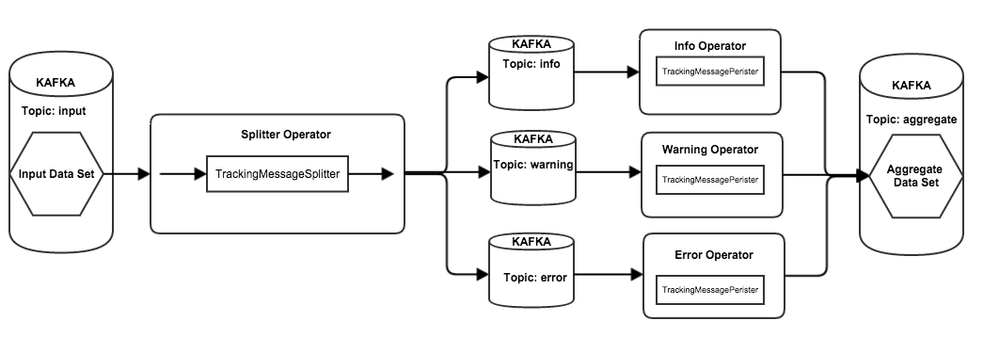

API Guide for Dataflow Submission
=====================

#Contents#
1. [Overview](#overview)
2. [Terminology](#terminology)
2. [Sample dataflow](#sample-dataflow)
3. [Sample Code](#sample-code)
4. [Dataflow Submission Design](#dataflow-submission-design)

---

#Overview#

In this guide we'll walk through how to use the Scribengin API to build a dataflow.  This is an arbitrary dataflow used to showcase the capabilities of the Scribengin system and API.  We'll use the Scribengin API to submit your dataflow to a running instance of Scribengin.

To be able to submit your dataflow to Scribengin, first you'll need to :

1. Write, compile, build, and release a dataflow jar
2. Have that dataflow jar somewhere on your system locally
3. Start a Scribengin Cluster
4. Write a dataflow submission application like below

---

#Terminology#

DataSet - Input/Output sources and sinks

Operator - Reads in from a dataset or another operator, and outputs to an operator or dataset.  Can perform filtering, transformation, or enhancement of data passing through

---
#Sample Dataflow#

The dataflow we'll be building in this example will look like this.  We'll be reading in from kafka, storing the data into 3 split topics for buffering, then moving all the data back into Kafka under a new topic.



---

#Sample Code#
```java
import com.neverwinterdp.scribengin.dataflow.Dataflow;
import com.neverwinterdp.scribengin.dataflow.DataflowDescriptor;
import com.neverwinterdp.scribengin.dataflow.DataflowSubmitter;
import com.neverwinterdp.scribengin.dataflow.Operator;
import com.neverwinterdp.scribengin.dataflow.DataStreamOperator;
import com.neverwinterdp.scribengin.dataflow.DataStreamOperatorContext;
import com.neverwinterdp.storage.kafka.KafkaStorageConfig;
import com.neverwinterdp.scribengin.shell.ScribenginShell;
import com.neverwinterdp.util.JSONSerializer;
import com.neverwinterdp.vm.VMConfig;
import com.neverwinterdp.vm.client.VMClient;
import com.neverwinterdp.vm.client.VMSubmitter;
import com.neverwinterdp.vm.client.shell.CommandInput;
import com.neverwinterdp.vm.client.shell.Shell;


public class DataflowLauncher {
  //Where your dataflow jar lives on your local system
  private String localAppHome        = "/local/path/to/dataflow/jar";

  //Where the dataflow jar we're going to upload will live in HDFS
  private String dfsAppHome          = "/applications/tracking-sample";

  //Where to store the report from the dataflow
  private String trackingReportPath  = "/applications/tracking-sample/reports";

  //Your dataflow's ID
  private String dataflowId          = "Sample";

  //The storage we'll be using
  //Current possible values:
  //  - kafka
  //  - hdfs
  //  - s3
  private String dataflowStorage     = "kafka";

  //The number of workers to use (YARN containers)
  private int numOfWorker            = 8;

  //The number of executors to use (Basically, the number of threads per worker)
  private int numOfExecutorPerWorker = 2;
  
  //This function focuses on uploading the dataflow jar and then submitting a dataflow configuration
  public void execute(Shell s) throws Exception {
    //Connect with Scribengin
    ScribenginShell shell = (ScribenginShell) s;
    VMClient vmClient = shell.getVMClient();
    
    //Upload the dataflow jar
    vmClient.uploadApp(localAppHome, dfsAppHome);
    
    //In the next steps, we'll build our configuration for the dataflow

    //Set number of workers, number of executors, and Tracking Window Size
    TrackingDataflowBuilder dflBuilder = new TrackingDataflowBuilder(dataflowId);
    dflBuilder.
      setNumOfWorker(numOfWorker).
      setNumOfExecutorPerWorker(numOfExecutorPerWorker).
      setTrackingWindowSize(10000);
    
    //Specific configurations for HDFS as final data storage
    if("hdfs".equalsIgnoreCase(dataflowStorage)) {
      dflBuilder.setHDFSAggregateOutput();
      dflBuilder.getTrackingConfig().setHDFSAggregateLocation("/storage/hdfs/tracking-aggregate");
    }
    
    //Set the report path
    dflBuilder.getTrackingConfig().setReportPath(trackingReportPath);
    
    //Set Zookeeper [host]:[port]
    dflBuilder.getTrackingConfig().setKafkaZKConnects(vmClient.getRegistry().getRegistryConfig().getConnect());

    
    //Build the dataflow (See buildDataflow function below for configuration)
    Dataflow<TrackingMessage, TrackingMessage> dfl = buildDataflow();
    //Get the dataflow's descriptor
    DataflowDescriptor dflDescriptor = dfl.buildDataflowDescriptor();
    //Output the descriptor in human-readable JSON
    System.out.println(JSONSerializer.INSTANCE.toString(dflDescriptor));
    
    //Ensure all your sources and sinks are up and running first, then...

    //Submit the dataflow and wait until it starts running
    new DataflowSubmitter(shell.getScribenginClient(), dfl).submit().waitForRunning(60000);
    
  }

/////////////
  
  //The configuration of the dataflow
  public Dataflow<TrackingMessage, TrackingMessage> buildDataflow() {
    //Create your dataflow object
    //Dataflow<Message, Message>("dataflow")
    //  <Message,Message> corresponds to the input/output objects your source and sink will use
    //  "dataflow" will be your dataflow's ID
    Dataflow<Message, Message> dfl = new Dataflow<Message, Message>("dataflow");
     
    //Use a factory to set the dataflow as a "Wire"
    //We'll be "wiring" dataflows together
    dfl.useWireDataSetFactory(new KafkaWireDataSetFactory("127.0.0.1:2181"));
     
    //Configure the input dataset
    KafkaDataSet<Message> inputDs =
        dfl.createInput(new KafkaStorageConfig("input", "127.0.0.1:2181", "input"));
    //Configure the output dataset
    KafkaDataSet<Message> aggregateDs =
        dfl.createOutput(new KafkaStorageConfig("aggregate", "127.0.0.1:2181", "aggregate"));
    
    //Defining Operators
    //An Operator takes an <Input, Output> (Same as dataflow)
    //And defines which Operator class to use - in this case TrackingMessageSplitter
    Operator<Message, Message> splitterOp = dfl.createOperator("splitter", TrackingMessageSplitter.class);
    Operator<Message, Message> infoOp     = dfl.createOperator("info",     TrackingMessagePerister.class);
    Operator<Message, Message> warnOp     = dfl.createOperator("warn",     TrackingMessagePerister.class);
    Operator<Message, Message> errorOp    = dfl.createOperator("error",    TrackingMessagePerister.class);
    //Here we define the wire
    //inputDs is the input we get from Kafka, and gets sent into the splitterOperator
    inputDs.
      connect(splitterOp);
    //The splitterOperator then connects its output to the other intermediate operators
    splitterOp.
      connect(infoOp).
      connect(warnOp).
      connect(errorOp);
     
    //The intermediate operators then all push their data into an aggregate dataStore
    infoOp.connect(aggregateDs);
    warnOp.connect(aggregateDs);
    errorOp.connect(aggregateDs);
     
    //This builds and prints out the dataflow Descriptor that we've just built
    DataflowDescriptor testDflConfig = dfl.buildDataflowDescriptor();
    System.out.println(JSONSerializer.INSTANCE.toString(testDflConfig));
  }

}

```

---

#Dataflow Submission Design

