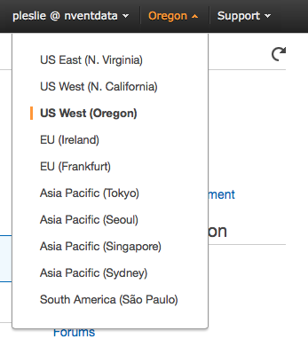
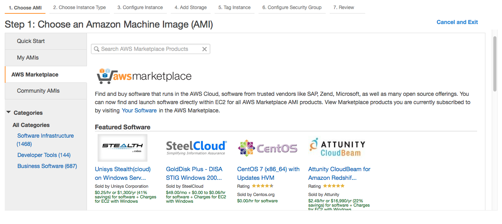
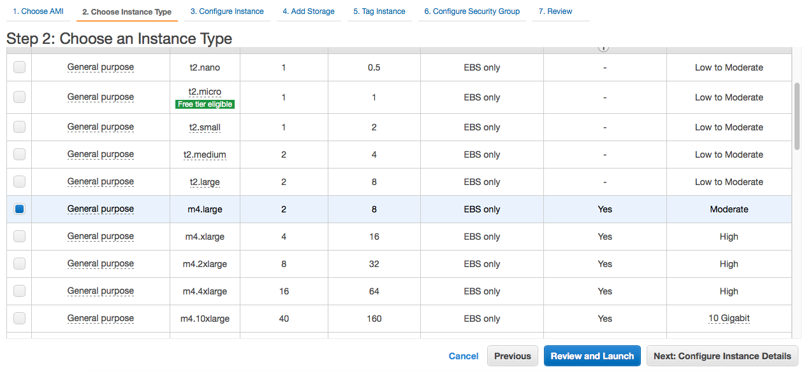
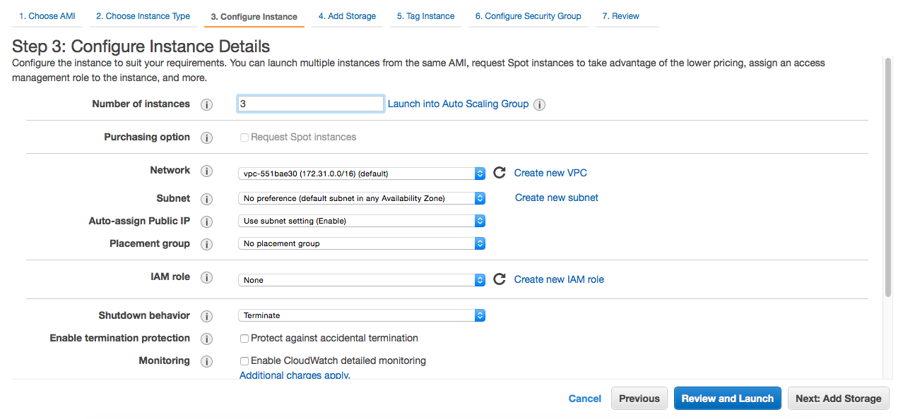
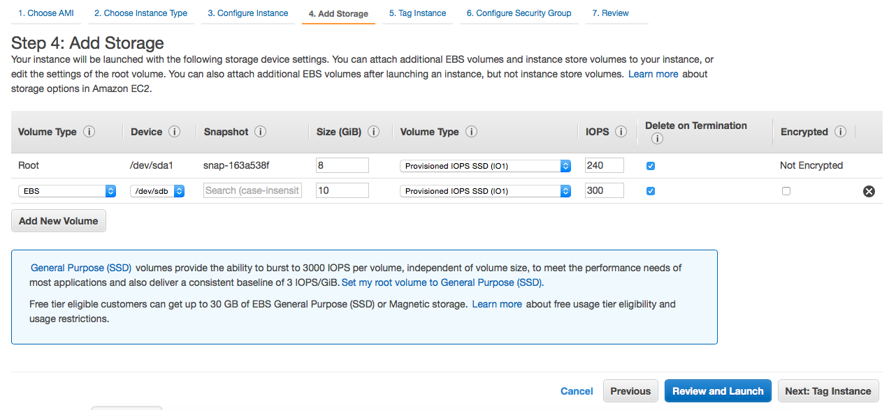
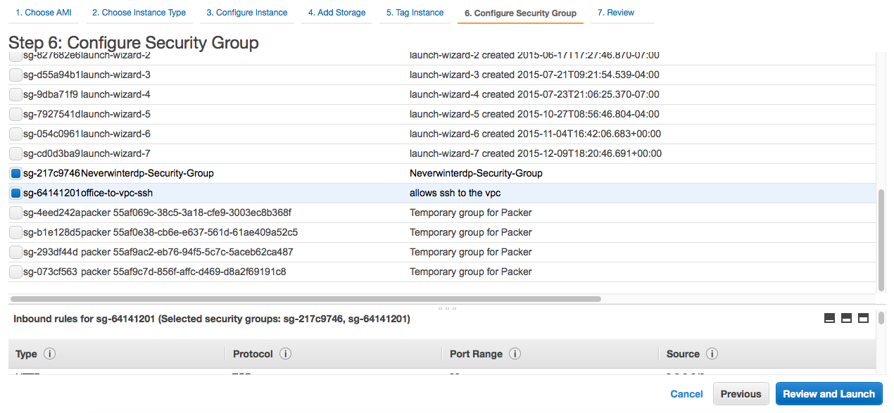
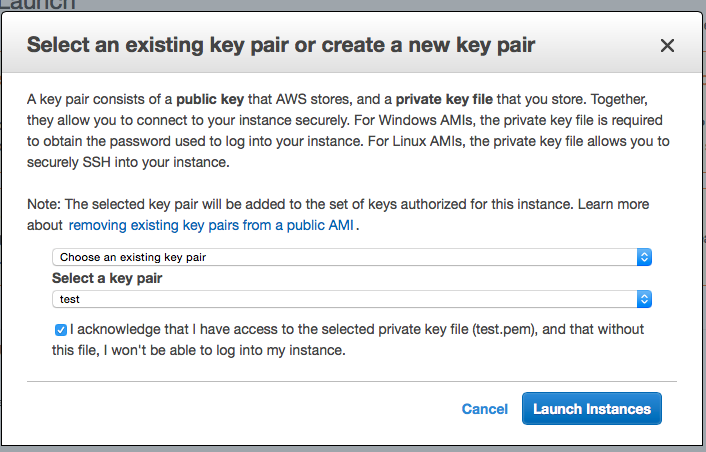
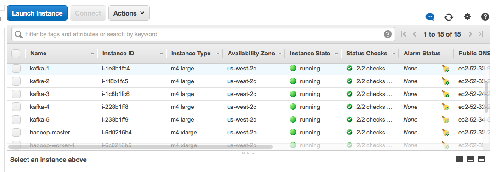
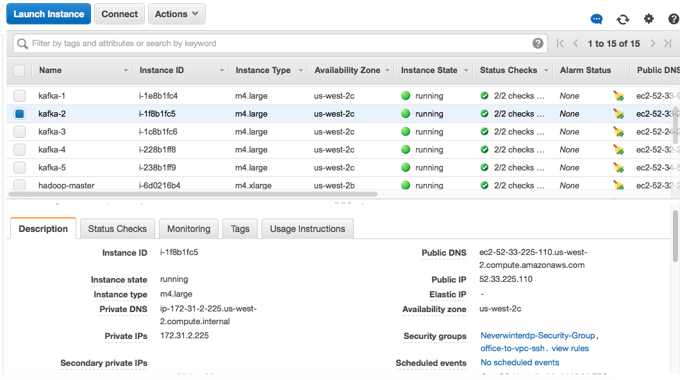

Scribengin Quickstart
=====================

#Contents#
1. [Overview](#general-steps-to-setup)
2. [Build NeverwinterDP](#build-neverwinterdp)
3. [Automation Prerequisites](#automation-prerequisites)
3. [Setup a cluster automatically in Docker](#docker-setup) 
4. [Setup a cluster automatically in Digital Ocean](#digital-ocean-setup)
5. [Setup a cluster manually in AWS](#AWS-setup) 
6. [Setup a cluster automatically somewhere else](#arbitrary-cluster-setup) 
7. [Launching Scribengin manually in an already setup YARN cluster ](#manually-launching)
8. [Launching a Datafow from a preconfigured test](#launching-a-dataflow-from-a-preconfigured-test)
9. [Monitoring Scribengin](#monitoring-scribengin)

---

#General Steps To Setup#

1. You need to check out NeverwinterDP code and build
    * Check out NeverwinterDP from https://github.com/Nventdata/NeverwinterDP
    * Build Scribengin with gradle
2. Setup the scribengin cluster using Docker, Digital Ocean, or any VM provider
    * Install java and other requirement on the VMs
    * Update /etc/hosts so the VMs know about each other
    * Run Zookeeper, Hadoop, and YARN
    * Optionally run Kafka, Elasticsearch...
3. Launch the VM Master (Scribengin's YARN Application Master)
4. Submit your dataflow

---

#Build NeverwinterDP#

Checkout NeverwinterDP 

```
git clone https://github.com/Nventdata/NeverwinterDP
cd NeverwinterDP
```
You may want to work with the latest code, switch to the dev/master branch

```
git checkout dev/master 
```

Pull for the latest code

```
git pull origin dev/master 
```

Build and release the NeverwinterDP code

```
gradle clean build install release -x test
```

You will find the release, binaries, and shell scripts in ```NeverwinterDP/release/build/release/neverwinterdp```

You need to set the NEVERWINTERDP_HOME environment variable (optional) in order the other cluster script can build and deploy Scribengin automatically

```
export NEVERWINTERDP_HOME=/your/path/to/NeverwinterDP
```


---
#Automation Prerequisites#

1. [Install Ansible](http://docs.ansible.com/ansible/intro_installation.html)
2. [Install and configure Docker](https://docs.docker.com/engine/installation/)
3. [Install Gradle](https://docs.gradle.org/current/userguide/installation.html)
4. Install Java 7 
5. Install Python 2.7
6. Make sure the user you are running as has write permissions for /etc/hosts
    * Setup scripts will update your /etc/hosts file, but will not remove any entries that are already there
7. Setup your SSH config

    ```
       echo -e "Host *\n  StrictHostKeyChecking no" >> ~/.ssh/config
    ``` 
    
8. If you want to work with S3, set up your credentials file in this format    

     `````
     user@machine $ cat ~/.aws/credentials
     [default]
     aws_access_key_id=XXXXX
     aws_secret_access_key=YYYYYY
     ````` 


#Docker Setup#
This will require access to Nvent's private repos.  Continue on to [Launching Scribengin cluster manually](#manually-launching) if you do not have access. 

The following steps will deploy all the necessary components to run Scribengin locally by using Docker.

1. Clone deployments and tools repo
        
        git clone git clone https://<bitbucket_user>@bitbucket.org/nventdata/neverwinterdp-deployments.git

2. Set up for neverwinter tools
        
        #Run the setup script for tools (only necessary ONCE)
        sudo ./neverwinterdp-deployments/tools/cluster/setup.sh

3. Build docker image with scribengin in one step
        
        #Build images, launch containers, run ansible
        ./neverwinterdp-deployments/docker/scribengin/docker.sh  cluster --launch

        #If you decided not to set NEVERWINTERDP_HOME, then you can pass it in manually here
        ./neverwinterdp-deployments/docker/scribengin/docker.sh  cluster --launch --neverwinterdp-home=/your/path/to/NeverwinterDP

4. If you wish to DESTROY your cluster (clean images and containers)
        
        ./neverwinterdp-deployments/docker/scribengin/docker.sh cluster --clean-containers --clean-image


#Digital Ocean Setup#
This will require access to Nvent's private repos.  Continue on to [Launching Scribengin cluster manually](#manually-launching) if you do not have access. 

The following steps will deploy all the necessary components to run Scribengin in the cloud via Digital Ocean.  You'll also need a Digital Ocean account and a Digital Ocean token (see step 3)

1. Clone deployments and tools repo
        
        git clone git clone https://<bitbucket_user>@bitbucket.org/nventdata/neverwinterdp-deployments.git

2. Set up for neverwinter tools
        
        #Run the setup script for tools (only necessary ONCE)
        sudo ./neverwinterdp-deployments/tools/cluster/setup.sh

3. Set up your Digital Ocean token

        #To get a token visit - 
        #  https://cloud.digitalocean.com/settings/applications#access-tokens
        echo "TOKENGOESHERE" > ~/.digitaloceantoken


4. Run the Digital Ocean automation
        
        cd ./neverwinterdp-deployments/tools/

        ./cluster/clusterCommander.py \
          digitalocean \
          --launch --neverwinterdp-home $NEVERWINTERDP_HOME \
          --ansible-inventory \
          --create-containers $ROOT/ansible/profile/stability.yml \
          --subdomain $SUBDOMAIN --region nyc3

5. Install Scribengin and necessary cluster services
        
        ./serviceCommander/serviceCommander.py \ 
          --cluster --install --configure --profile-type stability


#AWS-setup

1.Login in to amazon console

2.Select region 


	
3.Click on 'Launch Instance' button in the scree
4.Click on 'AWS Marketplace' to select the software from AWS Marketplace


 
5.Click/Select on 'CentOS 7 (x86_64) with Updates HVM'

6.Select Instance Type



7.Configure Instance.



- Make sure that you have entered correct number of instance that you want to - launch in 'Number of instances' field. 
- Select 'Shutdown behavior' field option to 'Terminate' so that OS level shutdown behaviour is performed.


8.Add Storage



- By default you have 'Root'. Leave that as it is.
- Add new stroage type 'EBS' by clicking 'Add New Volume' seen below the table. 
- Set the size of the volume that you need in 'Size (GiB)' field.
- Choose the 'Volume Type' to 'Provisioned IOPS SSD (IO1)'. By selecting this you can change IOPS value that you want.
- Set IOPS that you want in 'IOPS' field.
- Make sure that 'Delete on Termision' field is checked (Recomonded for testing not for production). Because EBS volumes persist independently from the running life of EC2 instances. By choosing this option to checked, EBS volume associted too the EC2 instance will be deleted when its terminated.


9.Tag Instance (Optional). you can skip this for now.

10.Configure Secuirity Group




For now select an existing security group. Which is already created for testing purposes. Select two security group as seen in the above picture.

11.Click 'Review and Launch'. On the next screen review all the configurations that you set. And then click 'Launch' button to launch the instances.

12.When Launching instances, it will prompt to select 'Key Pair', which is used to communicate with ec2 instances securely. You can create new key pair or select an existing key pair. Make sure you have keypair file with an extention *.pem if you select an existing keypair. And the click Launch Instances.



13.You can see all the instances in the Instance table.



You can name the instances as you want for identification purpose.

14.You can get Public IP and Private IP by selecting any one instance from the instance list, and you can see the private and public IP on the 'Description' tab below the table.



15.Edit the /etc/hosts of your local machine with instances public IPs.

Example:

```
##SCRIBENGIN CLUSTER START##
52.1.1.1 hadoop-master
52.1.1.2  hadoop-worker-1
52.1.1.3  hadoop-worker-3
52.1.1.4  monitoring-1
52.1.1.5  kafka-4
52.1.1.6  kafka-5
52.1.1.7  hadoop-worker-2
52.1.1.8  zookeeper-1
52.1.1.9  elasticsearch-1
52.1.1.10  kafka-3
52.1.1.11  kafka-1
52.1.1.12  kafka-2
##SCRIBENGIN CLUSTER END##
```
Now you can able to communicate with ec2 instances with hostname.


16.SSH into instance. Initially you can able to login to the instance with the user 'centos'. To ssh login you need to use keypair pem file that you have.

```ssh -i /path/to/test.pem centos@monitoring-1```

17.Yes you logged into ec2 instance. Initially EBS volume is not mounted to the ec2 instance. Make EBS volume available. For that we need to format the volume with appropriate file system and then mount it. run the below command for ec2 centos instance.

```
sudo mkfs -t xfs /dev/xvdb
sudo mount /dev/xvdb /opt
```

If the above is not working or to know more about making EBS available, please read [Making an Amazon EBS Volume Available for Use](http://docs.aws.amazon.com/AWSEC2/latest/UserGuide/ebs-using-volumes.html) from amazon user guide website.
 
18.Add neverwinterdp user. To add user and edit /etc/sudoers you need to login as root user. To do so after login as 'centos' user type ```sudo -i``` and press enter to login as root user. And run the below commands
 
```
useradd -m -d /home/neverwinterdp -s /bin/bash -c "neverwinterdp user" -p $(openssl passwd -1 neverwinterdp)  neverwinterdp
echo "neverwinterdp ALL=(ALL) NOPASSWD: ALL" >> /etc/sudoers
echo "root ALL=(ALL) NOPASSWD: ALL" >> /etc/sudoers
chown -R neverwinterdp:neverwinterdp /opt
cp -R /root/.ssh/ /home/neverwinterdp/
chown -R neverwinterdp:neverwinterdp /home/neverwinterdp/.ssh
echo "REPLACE HERE WITH YOUR PUBLIC KEY" >> /home/neverwinterdp/.ssh/authorized_keys
```

19.Update /etc/hosts file in all instances with private and public IPs of all instances. See [Machine Naming Conventions Below](#machine-naming-conventions)

Example

```
##SCRIBENGIN CLUSTER START##
172.0.0.13  hadoop-master hadoop-master.stability.kafka hadoop-master.stability.kafka.private
52.0.0.226  hadoop-master.stability.kafka.public
172.0.0.12 hadoop-worker-1 hadoop-worker-1.stability.kafka hadoop-worker-1.stability.kafka.private
52.0.0.46  hadoop-worker-1.stability.kafka.public
172.0.0.14 hadoop-worker-3 hadoop-worker-3.stability.kafka hadoop-worker-3.stability.kafka.private
52.0.0.233  hadoop-worker-3.stability.kafka.public
172.0.0.227 monitoring-1 monitoring-1.stability.kafka monitoring-1.stability.kafka.private
52.0.0.151  monitoring-1.stability.kafka.public
172.0.0.227 kafka-4 kafka-4.stability.kafka kafka-4.stability.kafka.private
52.0.0.59  kafka-4.stability.kafka.public
172.0.0.228 kafka-5 kafka-5.stability.kafka kafka-5.stability.kafka.private
52.0.0.37  kafka-5.stability.kafka.public
172.0.0.15 hadoop-worker-2 hadoop-worker-2.stability.kafka hadoop-worker-2.stability.kafka.private
52.0.0.84  hadoop-worker-2.stability.kafka.public
172.0.0.102 zookeeper-1 zookeeper-1.stability.kafka zookeeper-1.stability.kafka.private
52.0.0.247  zookeeper-1.stability.kafka.public
172.0.0.100 elasticsearch-1 elasticsearch-1.stability.kafka elasticsearch-1.stability.kafka.private
52.0.0.238  elasticsearch-1.stability.kafka.public
172.0.0.224 kafka-3 kafka-3.stability.kafka kafka-3.stability.kafka.private
52.0.0.71  kafka-3.stability.kafka.public
172.0.0.226 kafka-1 kafka-1.stability.kafka kafka-1.stability.kafka.private
52.0.0.150  kafka-1.stability.kafka.public
172.0.0.225 kafka-2 kafka-2.stability.kafka kafka-2.stability.kafka.private
52.0.0.110  kafka-2.stability.kafka.public
##SCRIBENGIN CLUSTER END##
```

20.Repeat 16,17,18,19 on all instances.

21.Install Scribengin and necessary cluster services

```
./serviceCommander/serviceCommander.py --cluster --install --configure --profile-type stability
```

Yes... AWS instance is ready now run scribengin.

#Arbitrary Cluster Setup
[Follow the steps in this guide for information on how to use Nvent's private automation to launch in any arbitrary cluster](arbitrary-cluster-guide.md).  These steps require access to Nvent's private repos.  

If you do not have access to these private repos, please continue on to [Manually Launching](#manually-launching)

#Manually Launching#

These steps will be necessary if you do not have access to Nvent's private automation repo's

###Prerequisites

1. Set up at least one Hadoop4 node
2. Set up YARN on Hadoop
3. Set up at least one Zookeeper node
4. Set up at least one ElasticSearch node
5. Set up any machines for sources/sinks (i.e. Kafka, etc)
6. Create a user on all the machines (These tweaks make things run smoothly without interruption)
  - username: neverwinterdp
  - ssh keys set up in ~/.ssh
  - has passwordless sudo
7. Set up all node's /etc/hosts file.  See [Machine Naming Conventions Below](#machine-naming-conventions)

        ##SCRIBENGIN CLUSTER START##
        10.0.0.1 elasticsearch-1 
        10.0.0.2 hadoop-master
        10.0.0.3 hadoop-worker-1
        10.0.0.4 hadoop-worker-2
        10.0.0.5 hadoop-worker-3
        10.0.0.6 zookeeper-1 
        ##SCRIBENGIN CLUSTER END##


###Machine Naming conventions
  
  We strongly suggest aptly naming the nodes in your cluster.

  - hadoop-master
    - Only one node of this is required
    - Runs Hadoop and YARN master processes
    - Needs to run
      - SecondaryNameNode
      - ResourceManager
      - NameNode
    - Since there is only ONE master, no sequential naming
  - hadoop-worker-*
    - Running Hadoop and YARN slave processes
    - Named sequentially, i.e.
      - hadoop-worker-1
      - hadoop-worker-2
      - etc...
    - Needs to run
      - DataNode
      - NodeManager
  - elasticsearch-*
    - Running elasticsearch
    - Named sequentially
    - Handles receiving logs and metric information
  - zookeeper-*
    - Runs zookeeper quorum
    - Named sequentially

###Launching Scribengin

1. Make sure you have the JAVA_HOME environment variable correctly set
2. [Build NeverwinterDP](#build-neverwinterdp)
3.  Make sure the Scribengin shell script is set correctly
        
        #After building, if you didn't edit your /etc/hosts file, you'll need to edit the file:
        #NeverwinterDP/release/build/release/neverwinterdp/scribengin/bin/shell.sh
        #   -Dshell.zk-connect    - [hostname]:[port] of your Zookeeper server
        #   -Dshell.hadoop-master - [hostname] of your master Hadoop node
        
        APP_OPT="$APP_OPT -Dshell.zk-connect=zookeeper-1:2181 -Dshell.hadoop-master=hadoop-master"

4.  Launch the VM Master in YARN
        
        #From release/neverwinterdp directory
        cd  NeverwinterDP/release/build/release/neverwinterdp/scribengin/bin/
          
        #To run the vm-master on top of hadoop yarn
        ./shell.sh vm start
        
        
        #To check the scribengin status
        ./shell.sh vm info

4.  [Use the Scribengin API to upload your Dataflow.](../dataflowDevelopment/dataflowDevTableOfContents.md)


#Launching a dataflow from a preconfigured test#

This test can be launched manually from the public NeverwinterDP repo
```
./NeverwinterDP/release/build/release/neverwinterdp/dataflow/tracking-sample/bin/run-tracking.sh
```

These tests are in Nvent's private automation repo

```
#The kafka test is a simple, quick test 
./neverwinterdp-deployments/tests/scribengin/tracking/integration/kafka-run-test.sh
    
#The kafka stability test is a more complicated, longer running test
./neverwinterdp-deployments/tests/scribengin/tracking/stability/stability-kafka-test.sh
```


#Monitoring Scribengin

###Navigate to Kibana to view real time metrics###

```
Point your browser to http://monitoring-1:5601
You can change the interval at which Kibana refreshes itself in the top panel, or manually refresh the page
```

###SSH onto a cluster node###
```
#neverwinterdp user has sudo permissions
ssh neverwinterdp@[node-name]
```


###Getting status of a running dataflow
```
#After you launch a dataflow on the command line, it will give you a command
# you can run to monitor the dataflow.  It will look similar to this.
./scribengin/bin/shell.sh plugin com.neverwinterdp.scribengin.dataflow.tool.tracking.TrackingMonitor \
   --dataflow-id [DATAFLOW NAME] \
   --report-path /applications/tracking-sample/reports \
   --max-runtime 0 \
   --print-period 15000 \
   --show-history-workers
```


  
