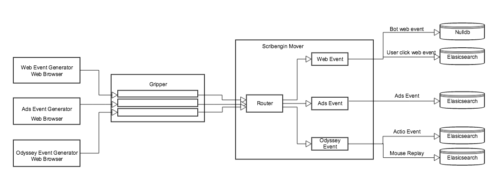

#Table of Contents#

- [Overview](#overview)
- [Project Overview](#project-overview)
  - [Lib](#lib)
  - [Module](#module)
  - [Registry](#registry)
  - [Scribengin](#scribengin)
  - [Release](#release)


#Overview#

The code is organized in the following hierachy
The first level is considered a project, and the second level consists of project components. A project can depend on another project or a component of another project.

```
NeverwinterDP
├── client
│   └── webui
├── docs
├── lib
│   ├── buffer
│   ├── utils
│   └── yara
├── module
│   ├── commons
│   ├── elasticsearch
│   ├── kafka
│   ├── netty
│   └── zookeeper
├── registry
│   ├── core
│   ├── vm
│   └── vm-sample
├── release
├── scribengin
    ├── core
    ├── dataflow
    │   ├── analytics
    │   ├── example
    │   └── sample
    ├── release
    └── storage
```


#Project Overview#

#Lib#

The lib project contains many small and independant libraries that are used to solve a speicific problem or requirement. A library component is  small, and only depend on the jre or 1 or 2 other third party libraries.

###utils###

1. The com.neverwinterdp.util contains many util classes that help to manage json, exception, reflection, list, map...
2. The com.neverwinterdp.util.text contains the util classes that help to fomat the text, convert the number , byte to string format , to print out the data in the tabular format.
3. The com.neverwinterdp.util.io contains classes that help to manage the files, read/write from/to InputStream and OutputStream.

###buffer###

The buffer project is based the chronicle queue https://github.com/OpenHFT/Java-Chronicle, which is a highly reliable and persisted framework. The buffer project extends the chronicle project by implementing a multiple queue that allows one thread to write to a segment while another thread dequeues from another segment; the read and write threads do not block each other.

###yara###

Yara project is a metric project base on the codahale or later drop wizard project concept. The main different between codahale and yara is yara uses the QDigest algorithm from https://github.com/addthis/stream-lib/tree/master/src/main/java/com/clearspring/analytics/stream/quantile. The main advantage from the qdigest algorithm is it uses less memory and allows us to merge data/metrics from multiple sources/servers. Check out AlgorithmComparatorUnitTest to see the different performance and accuracy of the codahale, QDigest and TDigest algorithm.


#Module#

The goal of the module project is to create a service api/framework that allows us to implement and deploy services in a single JVM. The project's goal is also to wrap other projects such as kafka, zookeeper, elasticsearch as a service for neverwinterdp.

###commons###

The commons component contains the service framework and api that is based on Google Guice.

###elasticsearch###

The elasticsearch project contains the service code wrapper that allow to run the elasticsearch as a neverwinterdp service. It also contains other code such as the elasticsearch client wrapper and the multi node server to simulate an elasticsearch cluster for unit testing.

###kafka###

The kafka module project contains: 

1. The service code wrapper that allows us to run the kafka as a neverwinterdp service. 
2. The multi node server to simulate the kafka cluster for unit testing.
3. The AckKafkaWriter - uses a buffer and resends a message if the message is sent to a dead broker and does not get an ack.
4. The KafkaPartitionReader - reads the message from a kafka partition, can commit or rollback to a previous commit already read.
5. The Kafka send and check tool. The tool is used to send a set of message to a topic and the check tool will retrieve the messages and check to see if there is any lost or duplicated messages.


#Registry#

The registry is a centralized service that maintains cluster data in a hierarchical structure. The service is used for maintaining configuration information, naming, providing distributed synchronization, and providing group services. The current registry is implemented on top of the zookeeper project.

###core###

The core component contains:

1. A Registry api that allow to create, retrieve, update the data in the registry
2. A zookeeper Registry implementation
3. A distributed lock framework that allow multiple servers synchronously access and read/write/update a resource
4. A distributed queue framework
5. A leader election framework to allow a server to be elected as a leader and the others stay as a backup.
6. A task framework is a a generic framework that keeps track of the task list, available tasks to process, the assigned tasks, the status of the tasks...
7. The task framework works as follows - A task master will read the configuration, compute and create a task list in the registry. The task worker will pickup a task from the available task list, create a heartbeat and mark the task as RUNNING and start working on the task. The worker may suspend the task and put the task back in the available list, and another worker may pick up the task again later and resume the task. If a worker fails in the middle, the task master should detect the broken heartbeat and put the task back in the available list.
8. The transaction event (txevent) framework allows one client to broadcast an event and obtain a watcher, the watcher will then notify the client when another server receives the event, to complete and process the event or other custom status.

###vm###

The vm component is a subproject of the registry. The vm project allows to dynamically manage a group of vm (virtual machine). The vm can be allocated on request and returned to the vm pool when it terminates. The framework consist of a vm master and  1 or more master slave. The vm master is responsible to allocate the vm, register it with the registry and detect the broken or terminated vm, return them to the vm pool. 

The vm project has 2 implementations:

1. The single jvm implementation, which all the vms run in the same jvm. Each vm has its own thread to run and manage the vm. The single jvm implementation is designed for unit testing.

2. The yarn implemetation is an implementation on top of YARN. In this implementation, the vm master is a YARN application master - it waits for requests and allocates yarn containers, then registers them with the vm registry framework into the registry.

###vm-sample###

The project contains a single class VMSampleApp which prints out a sample hello message. You can run it with the unit vm unit test framework or in a vm yarn application framework.

#Scribengin#

###storage###

The storage project is a subproject of the scribengin. It contains the api for the sink, source and various implementation such kafka, hdfs, S3, elasticsearch... 

basically a storage has the following structure

```
storage
  partitions
    partition-name
      partition-stream-0
      partition-stream-1
      ...
      partition-stream-n
```

Where the sink api allow to write to the storage and the source api allow to read the data from the storage. Certain storage type such kafka, elasticsearch... cannot have multiple partition hierarchy, in this case, those storage will have only one single partition. The other type of storage such hdfs, s3... can have multiple partitions, the partitions can be splitted by the time, or size. 

###core###
The core project(with the storage) is the main project of scribengin. It consist of some main components:

1. DataSet api is a set of object that allow to capture the configuration of the storage, serialize to json, store on the registry, where the master, worker and executor can access to get the instruction how to read/write the data from/to storage
2. The dataflow api consists of:
    * The Dataflow object which hold the information of the Dataset, operator. How the input DataSet are connected to the operator, how the operator connect to another operator or an output DataSet
    * The Operator is the logic to process the data. It can take in 1 or several input DataSet process the data and output to 1 or several other operator or DataSet
3. The registry consist of few different registry classes such ConfigRegistry, DataflowRegistry, DataflowTaskRegistry, MasterRegistry, WorkerRegistry, OperatorRegistry... each class is a registry helper that allow the master, worker access the different part of the dataflow registry to read, modify registry and coordinate with the master or the other worker
4. The master runtime is a set of service implementation that allow to control and coordinate the worker. The main role of the master are:
    * Take the dataflow configuration from the registry, validate and initialize the resources such check existence of the dataset storage, create if missing.
    * Create the the missing dataset that wire the operator together
    * Compute and create the tasks base the dataset and the dataset stream. Basically, each dataset stream will have a task associated with it.
    * Check the worker and executor configuration, request the vm manager to allocate a vm for each worker.
    * Listen to the worker heartbeat, detect the worker, task failure... request and allocate a new worker if a broken worker is detected.
5. The worker runtime is a set of service such the worker service, metric service, task service... When the worker is launched, the worker services will be initialized, it take the worker configuration from the registry, create a task service with a number of executors according to the configuration and start the task service. The executor in the task service will take a task from the registry, create a heartbeat for that task so the master can track the task for the failure, run the task according to the task configuration. If the worker or the executor fail, the heartbeat for the task will be broken and the master will take the task and put it back to the task queue so another executor can pick the task and resume. 
6. The tracking is designed to test the stability and reliability of the scribengin. The tracking consists  of:
    * The TrackingMessage is a message that contains the chunk id and the tracking id
    * The tracking generator that generate the message forward the message to a kafka topic. Periodically, the generator will update the progress to the registry.
    * The tracking validator that retrieve the messages from the different dataflow output destination, read the chunk id, and tracking id, resort the chunk id and the tracking id to find the duplication or lost.
    * The tracking also consist a tracking dataflow that take the generated message, process, and output to different destination.
    * The tracking also consist of the other tool or logic to simulate different kind of failure such, worker failure, master failure, power failure(all master , worker are failed).
7. The client api allow to assemble a dataflow and submit the dataflow to the registry and launch the dataflow by request the vm manager to allocate a dataflow master.
8. The shell allow the user to stop, resume a dataflow as well as monitor the dataflow by accessing the dataflow information in the registry.  


###dataflow###

####analytics####

The analytics is a sample dataflow that try to emulate the real use case of the scribengin. The analytics consist of:

1. Analytics has 3 different type events
    * The web event is the user click or load different web page event. When a webpage is loaded, a javascript in the webpage will capture the information about the browser, location, visitor... and send back to the gripper via gripper rest api.
    * Ads event is an event when the user click on an advertising banner. A javascript will capture the user click event, collect the information about the visitor, ads, location and send back to the gripper via gripper rest api
    * The odyssey event is other type of user event such the form submit, mouse move. The event will be collected by a javascript lib and send to the gripper.
2. The generator is the event generator that generate and simulate different type of events and send the events to the gripper.
3. The gripper is a http service that can receive different type of events, either from the generator or from the real user click on the web browser, via the rest api. The gripper will take the event and forward store in the different kafka topic according to the event type.
4. Scribengin Mover

See the diagram



####example####

The example dataflow project consist of some basic dataflow example such copy, wire or pipe, transform the data

####sample####

#client webui#


#Release#


```
release
├── elasticsearch
└── neverwinterdp
    ├── client
    │   └── webui
    ├── dataflow
    │   ├── analytics
    │   ├── example
    │   └── sample
    ├── scribengin
    └── vm-sample
```