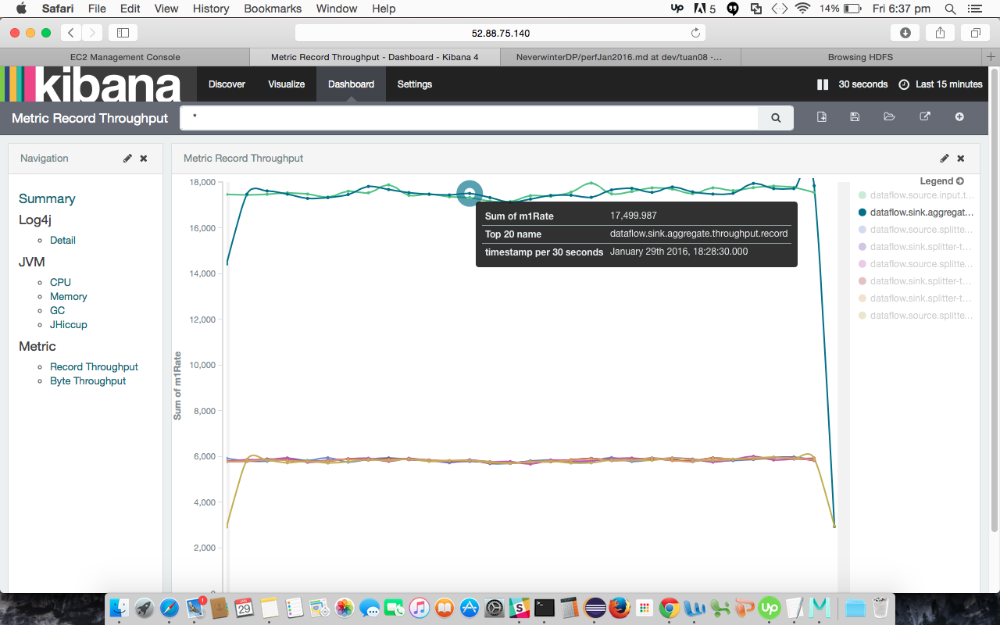
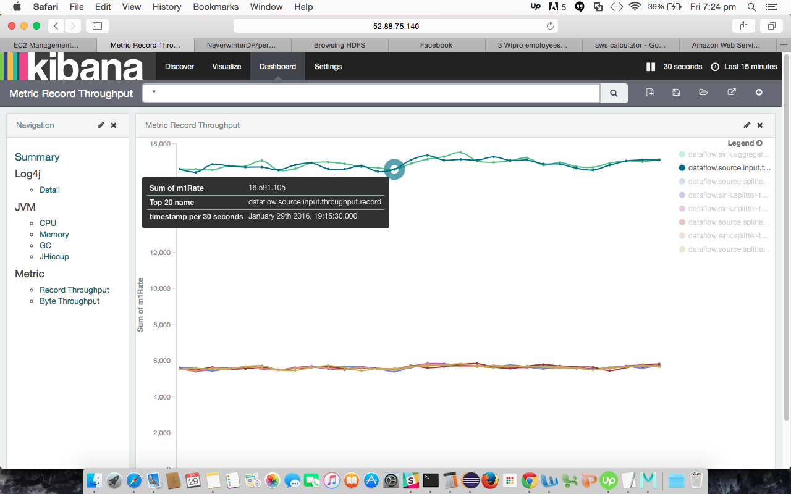
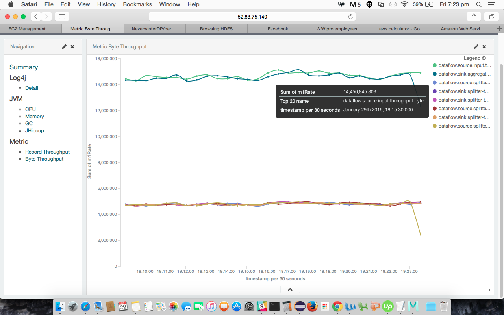

##Large 3 Workers - Delay 15


####Performance

|   Stat     |   Units        |
| ---------  | -------------- |
|     16,500 | records/second |
| 14,500,000 |   bytes/second | 

AWS Configuration

| Role          | Type      | Num Of Instances     |
| ------------- | --------- | -------------------- | 
| Hadoop-Worker | m4.large  |  3                   |
| Kafka         | m4.large  |  5                   |
| Hadoop-Master | t2.medium |  1                   |
| Zookeeper     | t2.small  |  1                   |
| Elasticsearch | t2.small  |  1                   |

####Configurations
```
GENERATOR_OPTS="\
  --generator-num-of-chunk 60 --generator-num-of-message-per-chunk 100000000 --generator-num-of-writer 1 --generator-break-in-period 15 \
  --generator-kafka-num-of-partition 8 --generator-kafka-num-of-replication 2 \
  --generator-max-wait-time 30000"

VALIDATOR_OPTS="--validator-num-of-reader 1 --validator-max-run-time 1000000000 --validator-message-wait-timeout 300000"

DATAFLOW_OPTS="\
  --dataflow-storage $TEST_STORAGE --dataflow-num-of-worker 8 --dataflow-num-of-executor-per-worker 2 \
  --dataflow-tracking-window-size 50000 --dataflow-sliding-window-size 100 \
  --dataflow-default-parallelism 8 --dataflow-default-replication 2"
 ``` 
  
##Large 3 Workers - Delay 5


Performance

|   Stat     |   Units        |
| ---------  | -------------- |
|     17,600 | records/second |
| 15,300,000 |   bytes/second | 

AWS Configuration

| Role          | Type      | Num Of Instances     |
| ------------- | --------- | -------------------- | 
| Hadoop-Worker | m4.large  |  3                   |
| Kafka         | m4.large  |  5                   |
| Hadoop-Master | t2.medium |  1                   |
| Zookeeper     | t2.small  |  1                   |
| Elasticsearch | t2.small  |  1                   |

####Configurations
```
GENERATOR_OPTS="\
  --generator-num-of-chunk 60 --generator-num-of-message-per-chunk 100000000 --generator-num-of-writer 1 --generator-break-in-period 5 \
  --generator-kafka-num-of-partition 8 --generator-kafka-num-of-replication 2 \
  --generator-max-wait-time 30000"

VALIDATOR_OPTS="--validator-num-of-reader 1 --validator-max-run-time 1000000000 --validator-message-wait-timeout 300000"

DATAFLOW_OPTS="\
  --dataflow-storage $TEST_STORAGE --dataflow-num-of-worker 8 --dataflow-num-of-executor-per-worker 2 \
  --dataflow-tracking-window-size 50000 --dataflow-sliding-window-size 100 \
  --dataflow-default-parallelism 8 --dataflow-default-replication 2"  
 ```
  

##Large 3 Workers - Delay 0 - Not stable all the time

####Performance

|   Stat     |   Units        |
| ---------  | -------------- |
|     18,500 | records/second |
| 15,300,000 |   bytes/second | 

AWS Configuration

| Role          | Type      | Num Of Instances     |
| ------------- | --------- | -------------------- | 
| Hadoop-Worker | m4.large  |  3                   |
| Kafka         | m4.large  |  5                   |
| Hadoop-Master | t2.medium |  1                   |
| Zookeeper     | t2.small  |  1                   |
| Elasticsearch | t2.small  |  1                   |

####Configurations
```
GENERATOR_OPTS="\
  --generator-num-of-chunk 60 --generator-num-of-message-per-chunk 100000000 --generator-num-of-writer 1 --generator-break-in-period 0 \
  --generator-kafka-num-of-partition 8 --generator-kafka-num-of-replication 2 \
  --generator-max-wait-time 30000"

VALIDATOR_OPTS="--validator-num-of-reader 1 --validator-max-run-time 1000000000 --validator-message-wait-timeout 300000"

DATAFLOW_OPTS="\
  --dataflow-storage $TEST_STORAGE --dataflow-num-of-worker 8 --dataflow-num-of-executor-per-worker 2 \
  --dataflow-tracking-window-size 50000 --dataflow-sliding-window-size 100 \
  --dataflow-default-parallelism 8 --dataflow-default-replication 2"
```


##Large 3 Workers - Delay 2
####Performance

|   Stat     |   Units        |
| ---------  | -------------- |
|     17,500 | records/second |
| 15,100,000 |   bytes/second | 

AWS Configuration

| Role          | Type      | Num Of Instances     |
| ------------- | --------- | -------------------- | 
| Hadoop-Worker | m4.large  |  3                   |
| Kafka         | m4.large  |  5                   |
| Hadoop-Master | t2.medium |  1                   |
| Zookeeper     | t2.small  |  1                   |
| Elasticsearch | t2.small  |  1                   |


####Configurations
```
GENERATOR_OPTS="\
  --generator-num-of-chunk 60 --generator-num-of-message-per-chunk 100000000 --generator-num-of-writer 1 --generator-break-in-period 2 \
  --generator-kafka-num-of-partition 8 --generator-kafka-num-of-replication 2 \
  --generator-max-wait-time 30000"

VALIDATOR_OPTS="--validator-num-of-reader 1 --validator-max-run-time 1000000000 --validator-message-wait-timeout 300000"

DATAFLOW_OPTS="\
  --dataflow-storage $TEST_STORAGE --dataflow-num-of-worker 8 --dataflow-num-of-executor-per-worker 2 \
  --dataflow-tracking-window-size 50000 --dataflow-sliding-window-size 100 \
  --dataflow-default-parallelism 8 --dataflow-default-replication 2"
```
####Screenshots



##Large 4 Workers - Delay 2

####Performance

|   Stat     |   Units        |
| ---------  | -------------- |
|     16,700 | records/second |
| 14,600,000 |   bytes/second | 

AWS Configuration

| Role          | Type      | Num Of Instances     |
| ------------- | --------- | -------------------- | 
| Hadoop-Worker | m4.large  |  4                   |
| Kafka         | m4.large  |  5                   |
| Hadoop-Master | t2.medium |  1                   |
| Zookeeper     | t2.small  |  1                   |
| Elasticsearch | t2.small  |  1                   |


####Configurations
```
GENERATOR_OPTS="\
  --generator-num-of-chunk 60 --generator-num-of-message-per-chunk 100000000 --generator-num-of-writer 1 --generator-break-in-period 2 \
  --generator-kafka-num-of-partition 8 --generator-kafka-num-of-replication 2 \
  --generator-max-wait-time 30000"


VALIDATOR_OPTS="--validator-num-of-reader 1 --validator-max-run-time 1000000000 --validator-message-wait-timeout 300000"

DATAFLOW_OPTS="\
  --dataflow-storage $TEST_STORAGE --dataflow-num-of-worker 8 --dataflow-num-of-executor-per-worker 2 \
  --dataflow-tracking-window-size 50000 --dataflow-sliding-window-size 100 \
  --dataflow-default-parallelism 8 --dataflow-default-replication 2"
```
####Screenshots



