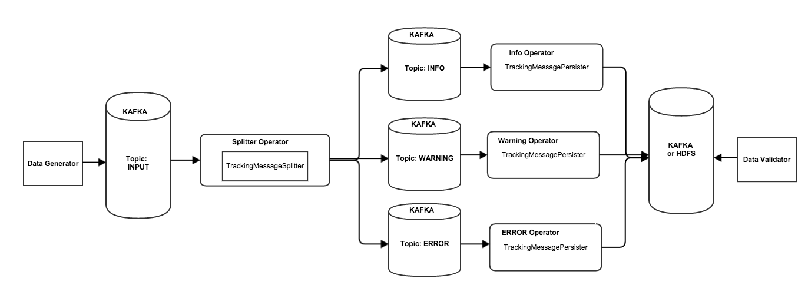

Scribengin Performance January 2016
===================================
#Contents#
1. [Methodology](#methodology)
2. [Results](#results)
3. [Conclusions](#conclusions)

#Methodology#

##Dataflow
The dataflow we'll be using to test Scribengin will be our splitter dataflow that's been enhanced for tracking messages.  This way we'll be able to test a complex, wired dataflow and also be able to validate all messages have been processed.

This dataflow will simulate a real case scenario for Scribengin - parsing logs.  Every record passed through contains data as well as a log level.  The log levels are INFO, WARNING, and ERROR.  The logs are split up by level by Scribengin, then each log level is processed individually to move into final storage.

In this test, we'll be moving data from Kafka, into intermediary Kafka topics, and finally moving the data into a single aggregate Kafka topic.  Scribengin will need to manage moving data between 5 topics with 8 partitions each.

All tests are run in AWS.

##Description

The **Data Generator** is responsible for generating data into Kafka.  The data is written into 8 partitions into a single topic.

The **Splitter Operator** reads data in from the **Input** Kafka topic, parses what the log level is, and moves the data into the corresponding Kafka topic.

The **Persister Operators** reads data from their corresponding topic and moves the data into the **Aggregate** Kafka topic.

Finally, the **Data Validator** reads the data in from the **Aggregate** Kafka topic and ensures all records have been successfully moved.

##Dataflow Configuration
| Config               | Value|
| -------------------- | ---  |
| Number of Workers    |  8   | 
| Executors per Worker |  2   | 
| Default Parallelism  |  8   | 

##Kafka Configuration
| Config                      | Value     |
| --------------------------- | --------  |
| num.network.threads         | 5         |
| num.io.threads              | 8         |
| socket.send.buffer.bytes    | 1048576   |
| socket.receive.buffer.bytes | 1048576   |
| socket.request.max.bytes    | 104857600 |
| default.replication.factor  | 2         |
| log.segment.bytes           | 400000000 |

##AWS Configuration

All AWS containers are configured to use EBS provisioned IOP (SSD) volumes.

Specifics to number of instances and instance types will be listed below.

#Results

##Small

<table>
<tr>
<td valign="top"><pre>
Performance

|   Stat     |   Units        |
| ---------  | -------------- |
|     13,500 | records/second |
| 11,500,000 |   bytes/second | 
</pre></td><td valign="top"><pre>
AWS Configuration

| Role          | Type      | Num Of Instances     |
| ------------- | --------- | -------------------- | 
| Hadoop-Worker | m4.large  |  3                   |
| Kafka         | t2.medium |  5                   |
| Hadoop-Master | t2.medium |  1                   |
| Zookeeper     | t2.small  |  1                   |
| Elasticsearch | t2.small  |  1                   |
</pre></td></tr></table>

##Large 3 Workers
<table>
<tr>
<td valign="top"><pre>
Performance

|   Stat     |   Units        |
| ---------  | -------------- |
|     17,000 | records/second |
| 15,000,000 |   bytes/second | 
</pre></td><td valign="top"><pre>
AWS Configuration

| Role          | Type      | Num Of Instances     |
| ------------- | --------- | -------------------- | 
| Hadoop-Worker | m4.large  |  3                   |
| Kafka         | m4.large  |  5                   |
| Hadoop-Master | t2.medium |  1                   |
| Zookeeper     | t2.small  |  1                   |
| Elasticsearch | t2.small  |  1                   |
</pre></td></tr></table>

##Large 4 Workers
<table>
<tr>
<td valign="top"><pre>
Performance

|   Stat     |   Units        |
| ---------  | -------------- |
|     20,000 | records/second |
| 17,500,000 |   bytes/second | 
</pre></td><td valign="top"><pre>
AWS Configuration

| Role          | Type      | Num Of Instances     |
| ------------- | --------- | -------------------- | 
| Hadoop-Worker | m4.large  |  4                   |
| Kafka         | m4.large  |  5                   |
| Hadoop-Master | t2.medium |  1                   |
| Zookeeper     | t2.small  |  1                   |
| Elasticsearch | t2.small  |  1                   |
</pre></td></tr></table>

##Large 5 Workers

<table>
<tr>
<td valign="top"><pre>
Performance

|   Stat     |   Units        |
| ---------  | -------------- |
|     20,000 | records/second |
| 17,500,000 |   bytes/second | 
</pre></td><td valign="top"><pre>
AWS Configuration

| Role          | Type      | Num Of Instances     |
| ------------- | --------- | -------------------- | 
| Hadoop-Worker | m4.large  |  5                   |
| Kafka         | m4.large  |  5                   |
| Hadoop-Master | t2.medium |  1                   |
| Zookeeper     | t2.small  |  1                   |
| Elasticsearch | t2.small  |  1                   |
</pre></td></tr></table>

##XLarge

<table>
<tr>
<td valign="top"><pre>
Performance

|   Stat     |   Units        |
| ---------  | -------------- |
|     23,500 | records/second |
| 20,500,000 |   bytes/second | 
</pre></td><td valign="top"><pre>
AWS Configuration

| Role          | Type       | Num Of Instances     |
| ------------- | ---------- | -------------------- | 
| Hadoop-Worker | m4.xlarge  |  4                   |
| Kafka         | m4.large   |  5                   |
| Hadoop-Master | t2.medium  |  1                   |
| Zookeeper     | t2.small   |  1                   |
| Elasticsearch | t2.small   |  1                   |
</pre></td></tr></table>

#Conclusions

Scribengin is limited by CPU, network speed, and disk speed.

A high level of parallelism (i.e. a large number of Kafka partitions) coupled with launching multiple workers per YARN container means Scribengin will be running a heavy load on the CPU.  More cores means Scribengin will be able to handle higher levels of parallelism more easily.

Network speed is crucial for a cluster to work effectively together.  An operator can only receive data as quickly as the network will transfer it.

Finally, disk speed is also crucial.  When the point of an operation is to read and write data, disk speed can be a limiting factor.  SSD's are highly recommended to get the most out of your Scribengin cluster.

As demonstrated by the difference between **Large 4 Workers** and **Large 5 Workers**, throwing more machines at the problem won't necessarily increase performance.  To properly make the most of your cluster, you must ensure your data is able to run in parallel, that data is correctly partitioned, and that your CPU can handle the amount of parallelism configured.  m4.large EC2 instances are limited in that they are 2 vCPU's each, which limits the available resources to handle that many simultaneous tasks.

On the same token, if you have faster machines, as demonstrated by the **Xlarge** cluster, your dataflow will benefit from having higher network throughput, but the m4.xlarge instances's vCPU's were largely under-utilized.

