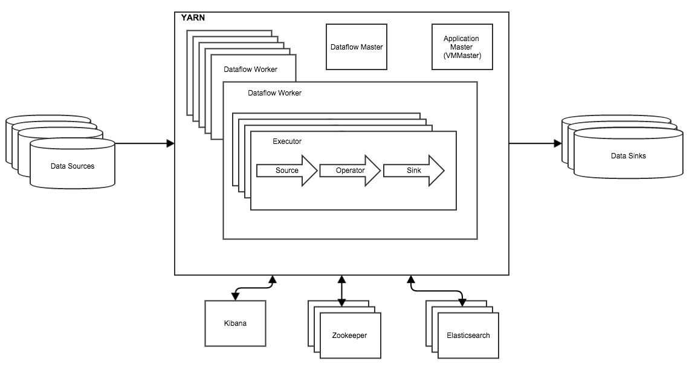

Scribengin Terminology
======================

#Introduction
In this document we'll discuss some of the higher level concepts of Scribengin.  The terminology in this guide will be used in other documents, so please refer back to this guide as a reference.

#High Level Cluster Design
The Scribengin Cluster at a high level.  The VM Master provisions containers, the Workers launch Dataflows, and the Dataflow's Tasks move data.

#High Level Dataflow
A Dataflow at a high level.  Data comes in from a source through a DataStream, is processed by a Dataflow, and is output into a Sink.

#Terms

##VM Master
The **VM Master** provisions containers for Scribengin.  Any time Scribengin requires a new container (i.e. for a dataflow worker or master), Scribengin must request the container from the VM Master.

Currently it is implemented in YARN for production.  The VM Master role is filled by a custom YARN Application Master. 

The VM Master is also implemented in-memory for unit testing).

##Registry
The **Registry** is the central place for tracking and configuration in Scribengin.  The **Registry** is implemented in Zookeeper.  Information such as **Dataflow** configuration, internal tasks, and tracking VMs are all stored centrally in the **Registry**

##Dataflow
A dataflow is how Scribengin moves data from a **source** into a **sink**.  A Dataflow is made up of a **Dataflow Master** and **Dataflow Workers** working to move data from a **Source** to a **Sink** in a reliable, performant way.

##Source
A **Source** is input data.  A **Source** can come from many different datastores, whether its Kafka, HDFS, S3, or something else.

##Sink
A **Sink** is where data ends up at the end of a **Dataflow**.  A **Source** can be Kafka, HDFS, S3, or any other datastore.

##Dataflow Master
The **Dataflow Master** monitors all the workers in a dataflow.  If a worker is lost due to error or failure, it replaces the worker and continues the dataflow.

##Dataflow Worker
A **Worker** is equivalent to a YARN container/VM/container for Scribengin to launch a node in.  Its the container requested by Scribengin from the VM Master.  Each **Worker** contains multiple **Executors**.

##Executor
An **Executor** can be thought of as a thread within the **Worker**.  Each **Executor** has slots to work on TWO **DataStreamOperators**.  These slots can work on any **DataStreamOperator**, and can also switch which task its working on.

##Operator 
An **Operator** is a collection of **DataStreamOperators** that all share the same logic.  Each **Executor** contains slots for two **DataStreamOperators**.

##DataStreamOperators
**DataStreamOperators** contain the arbitrary logic for transferring, transforming, filtering, and enhancing data.

##Wire
A **Wire** is a way of connecting different **DataStreamOperators**.  **DataStreamOperators** can be connected by placing a KafkaWire between them which uses a Kafka topic between the operators for better reliability.

##DataStream
A **DataStream** is a partition of data going through Scribengin.

